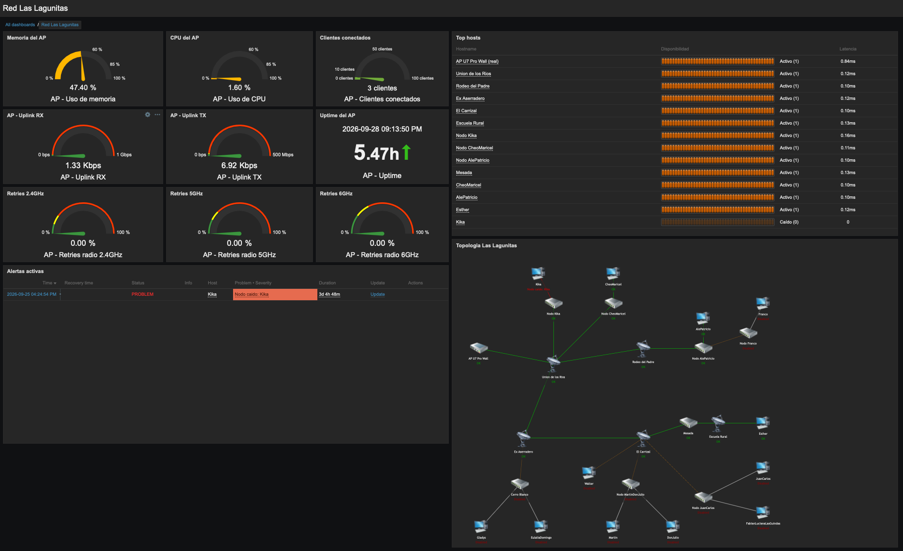

  
  

<h3 align="center">Universidad Nacional de Río Cuarto</h3>
<h3 align="center">Facultad de Ingeniería</h3>
<h3 align="center">Práctica Profesional Supervisada</h3>
<h1 align="center">“Diseño e implementación de un sistema de monitoreo para la RED comunitaria y científica Las Lagunitas”</h1>

| | |
|---|---|
| **Alumno** | Elias Coranti |
| **Tutor Universidad** | Pablo Solivella |
| **Tutor Empresa** | Daniel Bellomo |
| **Lugar** | Asociación civil Tierra Unida Activa, proyecto “Las Lagunitas Red Comunitaria y Científica” |
| **Periodo** | Septiembre 2025 a Diciembre 2025 |
| **Fecha de Entrega** | 25 de Septiembre de 2026 |

> Versión web del informe, generada desde el Word con `scripts/informe2md.py`.

## Resumen

La conectividad en zonas rurales continúa siendo un desafío para el desarrollo social, educativo y económico de numerosas comunidades. En este marco, la Red Comunitaria Las Lagunitas es una red inalámbrica de tipo WISP (Wireless Internet Service Provider) desplegada en el paraje Las Lagunitas, Alpa Corral, Córdoba, construida y sostenida de forma colaborativa entre la Universidad Nacional de Río Cuarto (UNRC), la Asociación Civil Tierra Unida Activa (ACTUA) y AlterMundi, que interconecta torres, nodos repetidores y hogares mediante enlaces inalámbricos punto a punto y punto-multipunto. Hasta el inicio de este trabajo, la red no contaba con ninguna herramienta de monitoreo: la detección de caídas de nodos o enlaces dependía exclusivamente del aviso informal de los propios vecinos.

Para resolver esta carencia, el presente trabajo desarrolló e implementó un sistema de monitoreo de red basado en Zabbix, capaz de detectar automáticamente caídas de nodos y enlaces, visualizar el estado de la red en tiempo real y generar alertas ante problemas. El desarrollo atravesó un relevamiento inicial de la topología y las variables críticas de la red real, una etapa de evaluación de herramientas y un laboratorio preliminar (Linux + Apache + TLS sobre máquina virtual), y culminó en la implementación de un laboratorio de monitoreo basado en Zabbix sobre contenedores Docker, que integra trece nodos simulados y un punto de acceso real (UniFi U7 Pro Wall) monitoreado de forma híbrida (API + ICMP). El sistema final incluye un dashboard con indicadores en tiempo real, un mapa de topología interactivo, disparadores (triggers) de alarma configurados y validados mediante pruebas reales de caída y recuperación de nodos, y documentación técnica completa (guía de despliegue y manual de administración) entregada a la organización para asegurar la continuidad y apropiación del sistema por parte de la comunidad.

## Objetivos

### Objetivos generales

Diseñar e implementar un sistema de monitoreo para la Red Comunitaria y Científica Las Lagunitas que permita supervisar el estado de la infraestructura y de los servicios, detectar fallas o interrupciones en la conectividad y generar herramientas de gestión técnica y comunitaria que contribuyan a la sostenibilidad, la autogestión y la expansión de la red.

### Objetivos específicos

- Relevar el estado actual de la red comunitaria (torres, nodos y hogares) e identificar las variables críticas a monitorear (tráfico, disponibilidad, calidad de enlace, registros de eventos, consumo energético, entre otras).

- Seleccionar y configurar herramientas de monitoreo adecuadas (por ejemplo, Syslog, Zabbix u otras alternativas de software libre) en función de los recursos técnicos y comunitarios disponibles.

- Implementar un sistema básico de monitoreo que permita visualizar el estado de la red en tiempo real, detectar anomalías y generar alertas.

- Documentar el proceso de instalación, configuración y pruebas del sistema de monitoreo, elaborando manuales y guías de uso accesibles para la comunidad.

- Capacitar a integrantes de la Red Comunitaria en la utilización y mantenimiento del sistema, promoviendo la autogestión local.

- Realizar pruebas piloto y proponer mejoras para optimizar el desempeño del sistema y su escalabilidad futura.

## Descripción de la organización

La Universidad Nacional de Río Cuarto (UNRC), a través de la Facultad de Ingeniería, impulsa prácticas profesionales supervisadas con proyección social como vía para que sus estudiantes apliquen los conocimientos adquiridos en la carrera de Ingeniería en Telecomunicaciones en entornos reales con impacto comunitario directo.

La Red Comunitaria y Científica Las Lagunitas es una iniciativa conjunta entre la UNRC, organizaciones sociales y actores locales del paraje Las Lagunitas (a 12 km de Alpa Corral, Córdoba), que busca garantizar el acceso equitativo a la conectividad como derecho fundamental, promoviendo la soberanía tecnológica y el desarrollo territorial. La Asociación Civil Tierra Unida Activa (ACTUA) acompaña el proyecto y gestionó la licencia VARC que habilita el despliegue de la red, mientras que AlterMundi aporta la colaboración técnica para la infraestructura de redes comunitarias inalámbricas.

## Marco conceptual

Antes de describir el relevamiento y la implementación concretos, conviene precisar dos conceptos sobre los que se apoya todo el trabajo: qué es una red comunitaria de tipo WISP y cómo está organizada internamente una plataforma de monitoreo como Zabbix.

### Redes comunitarias inalámbricas (WISP)

Un WISP (*Wireless Internet Service Provider*) es un proveedor de conectividad que utiliza enlaces de radiofrecuencia, generalmente en bandas no licenciadas (2,4 GHz y 5 GHz), en lugar de infraestructura cableada o de fibra óptica, como medio principal de acceso. Su arquitectura típica se organiza en dos niveles: un backbone de enlaces punto a punto de alta capacidad que interconecta torres o puntos elevados con línea de vista entre sí, y una capa de distribución punto-multipunto que, desde cada torre, lleva la señal hacia los usuarios finales. Esta topología resulta particularmente adecuada para zonas de baja densidad poblacional y geografía dispersa, donde el tendido de fibra o cableado resulta económicamente inviable.

Este déficit de conectividad rural no es anecdótico: un relevamiento conjunto del INTA y el ENACOM (2021) sobre 311 parajes rurales encontró que el 40 % carecía de conexión a internet, cifra que se duplica al incluir a quienes cuentan con un servicio deficiente; ocho de cada diez de estos lugares con acceso restringido vinculan la conectividad a necesidades concretas de la agricultura familiar, como educación, salud y trámites estatales (Guerrero, 2022). Frente a esta brecha, y donde un operador comercial no encuentra rentabilidad suficiente para desplegar infraestructura, surgen las redes comunitarias: en lugar de operar bajo un esquema empresarial tradicional, se construyen, gestionan y sostienen de forma colectiva por sus propios usuarios y organizaciones locales, bajo principios de autogestión, soberanía tecnológica y acceso equitativo a la conectividad como derecho.

En Argentina, una organización no gubernamental AlterMundi que promueve "un nuevo paradigma basado en la libertad a través de la colaboración entre pares" (Association for Progressive Communications \[APC\], s.f.) acompaña técnicamente este tipo de despliegues mediante LibreRouter y LibreMesh, tecnología de hardware y software libre pensada específicamente para que las comunidades rurales construyan y adapten sus propias redes sin depender de un proveedor comercial, y mediante "semilleros": espacios de formación para que las comunidades comprendan de forma autónoma el funcionamiento de sus propios equipos (Guerrero, 2022). La Red Comunitaria y Científica Las Lagunitas, descripta en la sección "Descripción de la organización" y sostenida conjuntamente por la UNRC, ACTUA y AlterMundi, es uno de los casos de este modelo documentados en prensa especializada, junto con experiencias similares en Cerro Colorado (Calamuchita) y otras catorce localidades de Santiago del Estero, Santa Fe y Neuquén (Guerrero, 2022).

Este tipo de infraestructura presenta, sin embargo, desafíos operativos propios que resultan centrales para el presente trabajo: la mayoría de los nodos no cuenta con alimentación eléctrica convencional y depende de energía solar autónoma, lo que introduce una fuente adicional de caídas de servicio no relacionada con el enlace en sí; y, a diferencia de un proveedor comercial, estas redes generalmente no cuentan con un equipo técnico dedicado ni un centro de operaciones (NOC) que supervise el estado de la infraestructura de forma permanente. Es justamente esta combinación de infraestructura distribuida, energéticamente vulnerable y sin monitoreo profesionalizado la que fundamenta la necesidad de una plataforma de monitoreo automatizada como la desarrollada en este trabajo.

### Zabbix: arquitectura general

Zabbix es una plataforma de monitoreo de infraestructura de código abierto, organizada en cuatro componentes principales que pueden desplegarse de forma independiente. El Zabbix Server es el motor central, este recolecta los datos reportados por los distintos métodos de chequeo, evalúa las condiciones definidas en los disparadores (triggers) y genera los eventos y alertas correspondientes. La base de datos (MySQL, en el caso de este trabajo) persiste tanto la configuración del sistema como el historial de métricas recolectadas, que alimenta los gráficos y reportes históricos. El Zabbix Frontend es la interfaz web, desde la cual se administra la configuración, se visualizan los dashboards con sus widgets y se construyen los mapas de topología interactivos.

Para obtener datos de los equipos monitoreados, Zabbix admite dos métodos, aplicados de forma diferenciada en este trabajo según el hardware disponible. El monitoreo basado en agente requiere instalar el software Zabbix Agent en el host a monitorear, que recolecta métricas locales del sistema y las reporta al servidor mediante chequeos activos, el agente solicita periódicamente su lista de tareas y envía los resultados, o pasivos, el servidor consulta directamente al agente; este es el esquema utilizado en el laboratorio simulado, donde cada nodo, al ser un contenedor Docker con sistema operativo propio, puede ejecutar el agente sin restricciones. El monitoreo sin agente (agentless), en cambio, no requiere instalar software adicional en el equipo: incluye chequeos simples como ICMP (ping) para verificar disponibilidad y latencia, y consultas SNMP, mediante las cuales un equipo expone sus métricas internas a través de un MIB (Management Information Base) estandarizado o propietario, sin necesidad de ejecutar ningún proceso adicional sobre el dispositivo. Este es el esquema aplicable a los equipos Ubiquiti y Mikrotik reales de la red, cuyo firmware propietario no admite la instalación de un agente, tal como se detalla en la sección "Variables críticas identificadas".

Sobre los datos recolectados por cualquiera de estos métodos, Zabbix permite definir disparadores (*triggers*). Estos disparadores alimentan, a su vez, las herramientas de visualización del Frontend como los dashboards compuestos por widgets configurables (listados de alertas activas, tablas de estado por host, indicadores puntuales) y mapas de topología interactivos, en los que cada elemento y cada enlace cambia de color en tiempo real según el estado de sus disparadores asociados.

## Metodología y justificación

Al momento de este trabajo, la red cuenta con 4 torres principales y 9 nodos intermedios en distintos estados de operación (operativos, en proceso y sin configurar), con 4 hogares y una institución educativa conectados de forma efectiva, además de otros hogares en proceso de incorporación. Esta infraestructura se sostiene mediante encuentros y talleres de capacitación comunitaria, en un modelo de autogestión que la organización busca consolidar y expandir.

Para llevar adelante el presente trabajo se organizó un plan de acción estructurado en cuatro fases:

**Fase 1: Relevamiento y análisis del estado actual.** Relevamiento de la infraestructura existente e identificación de las variables críticas a monitorear.

**Fase 2: Evaluación de herramientas y selección.** Investigación y comparación de plataformas de monitoreo, con pruebas iniciales en entorno de laboratorio.

**Fase 3: Implementación del sistema de monitoreo:** Diseño de la arquitectura, instalación y configuración del software, integración de nodos y configuración de alertas y paneles de visualización.

**Fase 4: Documentación, capacitación y cierre.** Elaboración de manuales técnicos, instancias de capacitación comunitaria y redacción del informe final.

## Fase 1: Relevamiento y análisis del estado actual

Se realizó un relevamiento detallado de la infraestructura de conectividad existente en la red comunitaria, abarcando torres de enlace, nodos intermedios, equipos de distribución y hogares conectados o en proceso de conexión. El trabajo incluyó la identificación de los distintos puntos de acceso y la reconstrucción de la topología completa de la red. Para cada sector se documentó el dispositivo instalado (nombre funcional, ubicación, marca y modelo, principalmente equipos Mikrotik y Ubiquiti, rol dentro de la red y dirección IP), así como los enlaces inalámbricos punto a punto y punto-multipunto que conectan los distintos nodos, identificando enlaces simples, enlaces encadenados y nodos que concentran múltiples conexiones hacia hogares.

A partir de este relevamiento se definieron las variables críticas a monitorear: disponibilidad de equipos, enlaces y nodos críticos; tráfico de red por interfaz y enlace, para anticipar saturaciones; calidad del enlace inalámbrico (nivel de señal y ruido, pérdida de paquetes, latencia), especialmente relevante en tramos con múltiples saltos; consumo eléctrico y estado de los dispositivos, dado que buena parte del equipamiento se encuentra en ubicaciones remotas con suministro eléctrico limitado; y eventos y registros (logs) relevantes para el diagnóstico y la auditoría posterior de incidentes. Este conjunto de variables constituyó la base para el diseño del sistema de monitoreo y la configuración de alertas

### Descripción general de la infraestructura relevada

La red se organiza en torno a cuatro torres estructurales, Unión de los Ríos, Rodeo del Padre, El Carrizal y Ex Aserradero que conforman el backbone de enlaces punto a punto, y a un conjunto de nodos repetidores intermedios (entre ellos Mesada y Cerro Blanco) que distribuyen la señal hacia los hogares finales. Del relevamiento surgen trece puntos de usuario final, entre viviendas familiares y la Escuela Rural de la zona: Kika, Cheo y Maricel, Ale y Patricio, Franco, Esther, Juan Carlos, Fabián y Luciana (Las Guindas), Walter, Gladys, Eulalia y Domingo, Martín, Don Julio, y la propia Escuela Rural.

### Inventario de equipos

| Equipo                  | Marca y tipo       |
|-------------------------|--------------------|
| Mikrotik Torre Walter   | Mikrotik RB750     |
| AP Torre Antena TV      | Ubiquiti PowerBeam |
| SM Torre Walter         | Ubiquiti PowerBeam |
| AP a Mesada             | Ubiquiti LiteBeam  |
| AP a Guindas            | Ubiquiti LiteBeam  |
| Nano Loco (no funciona) | Ubiquiti NanoLoco  |
| AP Martín               | Ubiquiti NanoLoco  |
| Nano Loco Casa Walter   | Ubiquiti NanoLoco  |
| Router AirCube Walter   | Ubiquiti AirCube   |
| SM Mesada               | Ubiquiti LiteBeam  |
| AP Mesada a Escuelita   | Ubiquiti LiteBeam  |
| SM Escuelita            | Ubiquiti NanoLoco  |
| SM Martín               | Ubiquiti NanoLoco  |
| SM Ester                | Ubiquiti NanoLoco  |
| AP Escuela-Ester        | Ubiquiti NanoLoco  |
| Router Torre Carrizal   | Ubiquiti AirCube   |
| Router Escuela          | Ubiquiti AirCube   |
| Router Ester            | Ubiquiti AirCube   |

### Topología real de la red

El siguiente gráfico esquemático, elaborado durante el relevamiento de campo, muestra la topología real de la Red Comunitaria y Científica Las Lagunitas: torres, nodos y hogares, junto con el estado de cada enlace (operativo, en proceso o sin configurar). Esta topología constituye la referencia completa de la red física y es la base sobre la que se plantea, en la sección de Mejoras futuras, la migración del sistema de monitoreo al entorno productivo.

**Figura 1.** Topología esquematica de la Red Las Lagunitas

### Estado de los enlaces

Los enlaces troncales entre las torres principales (Unión de los Ríos, Rodeo del Padre y Unión de los Ríos, Ex Aserradero), el corredor hacia El Carrizal, Mesada y Escuela Rural, y los tramos hacia Kika, Cheo/Maricel y Walter, se encuentran operativos. Los enlaces hacia Ale/Patricio, Esther, Franco, Juan Carlos y Martín figuran en proceso de configuración. Los enlaces derivados del nodo Cerro Blanco hacia Las Guindas (Fabián y Luciana), Don Julio, y Eulalia y Domingo, y Gladys se encuentran sin configurar. Esta convivencia de tramos operativos, en proceso y sin configurar es consistente con lo registrado en el diagnóstico inicial de trabajos previos sobre la red, donde se identificaron equipos físicamente instalados pero sin configuración de enlace punto a punto, cableado dañado o sin protección, gabinetes mal instalados, torres y postes de calidad precaria, y baterías de paneles solares agotadas.

 

**Figura 2.** Estado precario de la infraestructura de la Red Las Lagunitas

### Esquema de administración y conectividad

La administración de la red se centraliza en un router Mikrotik (RB750/RB950) que gestiona el direccionamiento IP mediante DHCP y aplica reglas de firewall y NAT. La conectividad a Internet se provee mediante un enlace PPPoE otorgado por la Cooperativa de Alpa Corral, en un acuerdo comunitario que cede ancho de banda a cambio de infraestructura de fibra tendida por el proyecto. El acceso remoto para tareas de administración y diagnóstico se realiza mediante un servidor VPN L2TP/IPsec configurado sobre el Mikrotik, accesible mediante la aplicación nativa de Windows y el puerto de administración Winbox. Los routers domésticos AirCube se configuran en modo bridge, de forma que todo el direccionamiento quede centralizado en un router principal, simplificando el control de la red.

Este esquema permite hoy un diagnóstico remoto, pero exclusivamente manual y reactivo: un operador debe conectarse por VPN y revisar enlace por enlace desde el software propietario de Ubiquiti para determinar si hay una caída, sin que exista ningún mecanismo de verificación automática ni de alerta ante fallas.

### Alimentación energética

La mayoría de los nodos no dispone de acceso a la red eléctrica convencional y depende de sistemas autónomos de generación solar fotovoltaica con baterías VRLA (12 V, 55 Ah) y controladores de carga PWM. El dimensionamiento energético relevado en trabajos previos, considerando una irradiancia promedio de 5,5 horas pico de sol para la región y una eficiencia global del sistema del 70 %, arroja una autonomía de entre 1,6 y 2 días sin aporte solar según el tipo de antena alimentada. Esta limitación energética es relevante para el diseño del monitoreo: una caída de nodo puede deberse tanto a una falla de enlace como al agotamiento de la batería, por lo que el estado de alimentación debe tratarse como una variable de monitoreo independiente y no inferirse únicamente de la disponibilidad del enlace.

### Monitoreo existente y sus limitaciones

Es importante distinguir dos capas de monitoreo que hoy coexisten sobre esta red. Por un lado, existe una implementación piloto de sensores ambientales sobre tecnología LoRaWAN, un sensor de temperatura y humedad en el Nodo Mesada y un sensor ultrasónico de nivel instalado en el tanque de agua de la Escuela Rural, integrados mediante un gateway y publicados en la plataforma en la nube Datacake, que permite visualización en tiempo real, históricos y alertas por correo electrónico. Esta capa, sin embargo, mide variables ambientales y de servicio puntuales, y no releva el estado de la infraestructura de red en sí (disponibilidad de nodos, calidad de los enlaces inalámbricos, estado de los routers domésticos).

Para la infraestructura de red propiamente dicha, no existe ninguna herramienta de monitoreo automatizado. La detección de caídas de nodos o enlaces depende del aviso informal de los propios vecinos o de una revisión manual por parte de un administrador conectado remotamente. No hay historización de disponibilidad, no hay alertas configurables ante caídas, y no existe una vista centralizada del estado de la red completa.

### Problemas detectados

Del relevamiento se desprende un conjunto de problemas que fundamentan la necesidad de un sistema de monitoreo: enlaces instalados pero sin configurar o sin funcionamiento**,** ausencia de visibilidad remota consolidada sobre el estado de toda la red, dependencia total de la intervención manual y del aviso informal para detectar fallas, documentación históricamente dispersa y sin formato unificado, una infraestructura energética con márgenes de autonomía ajustados que puede generar caídas de servicio indistinguibles, a simple vista, de una falla de enlace, y controladores de carga solar (Epever LS-E) sin ninguna interfaz de comunicación remota, lo que impide relevar el estado de las baterías de forma electrónica con el hardware actualmente instalado.

### Variables críticas identificadas

A partir de este diagnóstico se identificaron las variables que el sistema de monitoreo debería relevar, evaluando en cada caso la viabilidad real con el equipamiento instalado. La disponibilidad de cada nodo (chequeo activo por ICMP) es monitoreable de forma universal, ya que no depende del fabricante ni del firmware: aplica tanto a los equipos airMAX como a los routers AirCube y al núcleo Mikrotik. La calidad del enlace punto a punto, señal recibida (RSSI), piso de ruido, calidad de canal (CCQ) y capacidad estimada, es relevable vía SNMP en los equipos de la familia airMAX (PowerBeam, LiteBeam, NanoStation/NanoLoco), que exponen estos valores a través del MIB propietario de Ubiquiti (UBNT-MIB); de hecho, existen templates ya disponibles para Zabbix que implementan esta integración sin necesidad de desarrollo adicional. La latencia se obtiene igualmente por ICMP, sin requerir instrumentación adicional en los equipos.

No ocurre lo mismo con los routers AirCube instalados en los hogares: al utilizar un firmware distinto al de la línea airMAX, sin soporte de SNMP ni una API documentada, sólo es posible relevar su disponibilidad por ping, sin acceso a métricas de calidad de enlace Wi-Fi doméstico.

En cuanto al estado de la alimentación autónoma (batería y aporte solar), el relevamiento de los controladores de carga instalados, Epever de la serie LS-E, determinó que estos equipos no cuentan con ningún puerto de comunicación (RS-485/Modbus, Bluetooth o Wi-Fi), a diferencia de otras series del mismo fabricante (LS-B, Tracer) que sí lo incorporan y son compatibles con medidores remotos. En consecuencia, esta variable no puede monitorearse de forma remota con el hardware actualmente desplegado en la red, y se documenta aquí como una limitación identificada durante el relevamiento: su incorporación al sistema de monitoreo queda planteada como trabajo futuro, condicionada al reemplazo de los controladores por un modelo con interfaz de comunicación.

Este conjunto de variables, depurado según la viabilidad real de relevamiento, es el que orientó, en la etapa siguiente, la evaluación de herramientas y el diseño del sistema de monitoreo basado en Zabbix.

## Fase 2: Evaluación de herramientas y selección

Siguiendo lo previsto en la Fase 2 del plan de trabajo, se evaluaron dos enfoques de distinto alcance para el monitoreo de la red: por un lado, un esquema basado en Syslog, centrado en la recolección centralizada de registros (logs) emitidos por los equipos de red; por otro, una plataforma de monitoreo integral como Zabbix.

Un servidor Syslog (también llamado colector o receptor de syslog) centraliza los mensajes que le envían los dispositivos de la red (routers, switches, servidores, aplicaciones) quienes deben tener configurada de antemano la dirección IP de ese servidor como destino de sus logs. El protocolo no contempla un mecanismo inverso: el servidor no puede solicitarle activamente el estado a un equipo, sólo recibe lo que el equipo decide enviarle. La mayoría de los sistemas Unix y fabricantes de red (como Cisco) incluyen su propio receptor, y también existen herramientas de terceros que agregan sobre esa recepción básica un panel con contadores y reglas de filtrado para distinguir advertencias y errores relevantes del resto del tráfico. Dado el volumen de mensajes que puede generar Syslog, la capacidad crítica de cualquier receptor es justamente esa: filtrar y priorizar correctamente lo que llega, ya que el protocolo en sí se limita a reenviar datos sin ninguna evaluación de estado ni generación de alertas propia (Paessler AG, s.f.).

Syslog resulta adecuado para centralizar eventos y mensajes de diagnóstico, pero por sí solo no ofrece detección activa de disponibilidad, visualización gráfica del estado de la red, ni generación de alertas configurables: cubrir esas funciones exigiría desarrollar herramientas adicionales sobre esa base. Zabbix, en cambio, integra en una única plataforma el chequeo activo y pasivo de disponibilidad, la recolección de métricas, un motor de disparadores (triggers) configurable, mapas de topología con reflejo de estado en tiempo real, y un panel (dashboard) web con widgets gráficos, sin necesidad de desarrollo adicional.

Ambas alternativas son software libre, por lo que la decisión no respondió a una diferencia de costo sino de alcance funcional y de esfuerzo de implementación. Considerando los recursos técnicos y comunitarios disponibles, una organización sin equipo técnico dedicado, para la cual una plataforma única, autocontenida y con una curva de aprendizaje razonable resulta más sostenible que ensamblar y mantener herramientas adicionales sobre un esquema de logs, se seleccionó Zabbix como herramienta de monitoreo para la Red Las Lagunitas.

### Ejemplo comparativo: la misma caída de enlace, vista por cada sistema

Con un esquema Syslog: el Mikrotik de Torre Walter (RouterOS soporta el envío de logs a un servidor Syslog remoto) emite una línea de texto cuando el enlace cae, del estilo:

14:32:07 interface,info,link-down ether2 link down

Ese registro queda almacenado en el servidor de logs, mezclado con el resto del tráfico de eventos de la red. Por sí solo no dispara ninguna acción: para que alguien se entere de la caída, un administrador tendría que estar revisando el archivo de logs en tiempo real, o bien habría que desarrollar un componente adicional (un script que parsee el log, detecte el patrón "link down" y dispare un aviso), exactamente la limitación señalada en el párrafo anterior.

Con Zabbix: el mismo tipo de evento, en este caso registrado realmente en el laboratorio, con el nodo Kika caído, aparece en el dashboard sin que nadie tenga que revisar ningún archivo de texto. El widget "Alertas activas" lista el problema con el host afectado, la descripción del trigger ("Nodo caído: Kika"), la severidad resaltada en rojo y la duración transcurrida en tiempo real (52m 29s y contando desde que se disparó). En paralelo, el mapa de topología marca al nodo en rojo con la misma etiqueta, y la tabla "Top hosts" lo distingue de inmediato del resto mostrándolo como "Caído (0)", con 0 ms de latencia. Ninguna de estas tres vistas requiere que un operador esté interpretando líneas de log: el problema es visible apenas se abre el dashboard, con hora de inicio y severidad ya clasificadas.

**Figura 3.** Detección y alerta de la caída del host Kika

## Fase 3: Implementación del sistema de monitoreo

Es importante contextualizar el alcance de esta implementación: la construcción de la red de Las Lagunitas dependía de un proyecto de conectividad financiado externamente (convocatoria BOLT de ISOC Argentina, 2024), cuya ejecución no se completó según lo planificado y se encuentra en proceso. Esta circunstancia, documentada en la presentación de la conferencia BattleMesh v18 (Caminati, Bellomo y Campoamor, 2026), es la que fundamenta que la cátedra autorizara resolver el presente trabajo mediante un laboratorio de monitoreo simulado en lugar de un despliegue directo sobre la infraestructura productiva, tal como se adelantó en la introducción de "Relevamiento y análisis del estado actual".

La implementación final se desarrolló sobre una arquitectura de contenedores Docker que amplía y supera al laboratorio inicial, permitiendo representar simultáneamente múltiples nodos de la red. El laboratorio quedó compuesto por Zabbix Server, base de datos MySQL y Zabbix Frontend en contenedores independientes, junto con trece nodos simulados, las cuatro torres principales (Unión de los Ríos, Rodeo del Padre, El Carrizal y Ex Aserradero), cuatro nodos intermedios (Nodo Kika, Nodo CheoMaricel, Nodo AlePatricio y Mesada) y cinco hogares e institución (Kika, CheoMaricel, AlePatricio, Esther y Escuela Rural), que ejecutan agentes Zabbix sobre direccionamiento propio, y un punto de acceso real (UniFi U7 Pro Wall) integrado mediante un esquema híbrido de monitoreo (consultas a su API más chequeos ICMP), lo que permitió validar el sistema tanto contra infraestructura simulada como contra un equipo real de la red.

Sobre esta base se configuraron cuatro disparadores (triggers) de alarma con distintos niveles de severidad, un dashboard con múltiples widgets (indicadores del punto de acceso, tabla de estado de todos los nodos, listado de alertas activas) y un mapa de topología interactivo, con los catorce elementos de la red (trece nodos más el punto de acceso) y los enlaces entre ellos, que refleja en tiempo real, mediante colores, el estado de cada elemento y enlace.

El sistema se validó mediante una prueba de caída y recuperación real de extremo a extremo: al detener el contenedor del nodo Kika, el sistema generó automáticamente una alarma, el nodo pasó a estado "Caído" en el dashboard y el mapa reflejó en rojo tanto el elemento como su enlace; al recrear el contenedor, el sistema detectó la recuperación y todos los indicadores volvieron a su estado normal. Durante esta etapa también se identificó y corrigió un comportamiento de escalado automático del widget Top Hosts (los colores de las barras dependen del rango mínimo/máximo calculado dinámicamente), resuelto fijando manualmente los valores mínimo y máximo de la columna para asegurar una visualización consistente.

**Figura 4.** Dashboard principal

### Arquitectura general del sistema de monitoreo

#### Arquitectura del entorno de laboratorio

El laboratorio se desplegó sobre contenedores Docker sobre una Mac M3 (Colima como motor de contenedores), con red interna 10.50.0.0/24. El entorno central, Zabbix Server, MySQL y Zabbix Frontend, corre en contenedores independientes: el Server ejecuta los chequeos y evalúa los disparadores, MySQL persiste configuración e historial, y el Frontend expone el dashboard accesible por navegador vía HTTPS. Cada nodo simulado de la red (torres, nodos intermedios y hogares) corre en su propio contenedor con un agente Zabbix instalado, lo que permite emular el comportamiento real de un host monitoreado sin necesidad de acceso físico. El punto de acceso real UniFi U7 Pro Wall se integró aparte, con un esquema híbrido de API REST (métricas propias del equipo) e ICMP (disponibilidad de red), validando el sistema contra hardware real además de los nodos simulados.

**Figura 5.** Arquitectura del entorno de laboratorio

#### Arquitectura prevista para el entorno de producción

A diferencia del laboratorio, en un eventual despliegue sobre la red real el Zabbix Server, MySQL y el Frontend se instalarían sobre un servidor Linux físico ubicado en el nodo de la UNRC, con alimentación eléctrica convencional, a diferencia de la mayoría de las torres, opcionalmente virtualizado mediante Proxmox VE. La diferencia central no es de software sino de estrategia de monitoreo por nodo: los equipos reales (familia airMAX y routers AirCube) corren firmware propietario que no admite agente Zabbix, por lo que el monitoreo sería agentless, combinando ICMP para disponibilidad y SNMP (UBNT-MIB) para calidad de enlace en los equipos airMAX. El AP real mantendría el mismo esquema híbrido que en el laboratorio. Se suma además un circuito de respaldo ausente en el entorno simulado: una tarea cron ejecuta periódicamente un volcado de la base MySQL y la configuración, comprime el resultado y lo sube a almacenamiento en la nube externo al sitio.

**Figura 6.** Arquitectura del entorno de laboratorio

### Fase 4: Documentación, capacitación y cierre

Como cierre del trabajo se elaboró documentación técnica completa: una Guía de despliegue, con 18 procedimientos documentados que cubren desde la puesta en marcha del laboratorio hasta la configuración del mapa de topología y las pruebas de caída/recuperación, y un Manual de administración, con 12 secciones que abarcan arquitectura del sistema, puesta en marcha, apagado y reinicio seguro, gestión de alarmas y de nodos, mantenimiento y un extenso apartado de resolución de problemas basado en incidentes reales encontrados durante el desarrollo.

La instancia de capacitación presencial a integrantes de la Red Comunitaria, prevista originalmente en esta fase, no se concretó. Como mitigación de esta limitación, se dejó a disposición de la organización la documentación técnica mencionada, redactada con el objetivo explícito de permitir la autocapacitación de la comunidad cuando las condiciones de coordinación lo permitan. Finalmente, se redactó el presente informe final, que documenta e integra el proceso completo realizado.

## Resultados

A continuación, se comparan, punto por punto, los resultados esperados definidos en el Plan de Trabajo original con los resultados efectivamente obtenidos:

- **Sistema de monitoreo implementado.** *Logrado.* Se instaló y se puso en marcha una plataforma Zabbix funcional, capaz de visualizar en tiempo real el estado de la red y detectar fallas, interrupciones o anomalías mediante disparadores de alarma validados con pruebas reales.

- **Integración de infraestructura.** *Logrado sobre un laboratorio representativo.* Se integraron trece nodos que representan torres, nodos intermedios y hogares e institución de la red, más un punto de acceso real de la infraestructura, con métricas de disponibilidad. La integración de la totalidad de los equipos físicos de la red productiva queda como trabajo futuro (ver Mejoras futuras), condicionada además a la finalización del despliegue de conectividad sobre la red real, según lo señalado en la Fase 3.

- **Herramientas de gestión y alertas.** *Logrado.* Se configuraron disparadores de alarma, un dashboard con múltiples widgets y un mapa de topología interactivo que facilitan la operación y el diagnóstico rápido del estado de la red.

- **Documentación técnica.** *Logrado.* Se elaboraron una Guía de despliegue (18 procedimientos) y un Manual de administración (12 secciones), ambos accesibles tanto para perfiles técnicos como para integrantes de la comunidad sin formación específica en redes.

- **Capacitación comunitaria.** *No logrado.* La instancia de capacitación presencial prevista no pudo concretarse, condicionada por la interrupción en el despliegue de conectividad de la red física derivada de la situación del proyecto de financiamiento externo (BOLT/ISOC Argentina) descripta en la Fase 3, más que por una limitación de coordinación interna del equipo de trabajo. La documentación entregada (Guía de despliegue y Manual de administración) busca mitigar esta brecha, habilitando una autocapacitación futura una vez que las condiciones de despliegue lo permitan.

- **Informe final.** *Logrado.* El presente documento integra el proceso completo realizado, los resultados obtenidos y las propuestas de mejora y expansión futura.

En síntesis, de los seis resultados esperados, cuatro se cumplieron en su totalidad, uno se cumplió parcialmente (alcance de la integración de infraestructura, limitado a un laboratorio representativo por la falta de un despliegue físico completo sobre la red productiva) y uno no pudo concretarse por razones ajenas al desarrollo técnico del proyecto (la capacitación comunitaria).

## Conclusión

El desarrollo de este trabajo permitió diseñar e implementar un sistema de monitoreo funcional para la Red Comunitaria y Científica Las Lagunitas, partiendo de una situación inicial sin ningún mecanismo centralizado de control y avanzando hacia una plataforma capaz de detectar fallas de forma automática, visualizar el estado de la red en tiempo real y generar alertas ante interrupciones del servicio. El proceso atravesó un relevamiento riguroso de la infraestructura real, una etapa de evaluación comparativa de herramientas que fundamentó técnicamente la elección de Zabbix, y dos instancias de implementación un laboratorio preliminar sobre máquina virtual y una arquitectura final basada en contenedores Docker que reflejan una evolución lógica desde la validación conceptual hasta un sistema capaz de representar, aunque a escala reducida, la naturaleza distribuida de la red productiva.

La validación del sistema mediante pruebas reales de caída y recuperación de nodos, junto con la construcción de un mapa de topología interactivo, demuestra que la solución no solo es técnicamente viable, sino que efectivamente cumple con el objetivo de facilitar la gestión técnica de la red. Asimismo, la Guía de despliegue y Manual de administración como documentación constituye un aporte concreto para la sostenibilidad del sistema, al dejar disponible el conocimiento necesario para que la comunidad y sus referentes técnicos puedan operarlo y mantenerlo de forma autónoma.

No obstante, es importante reconocer honestamente que la capacitación comunitaria presencial, prevista como parte integral de la Fase 4, no pudo concretarse debido a la interrupción del despliegue de conectividad de la red física, derivada de la situación del proyecto de financiamiento externo descripta en la Fase 3. Esta limitación no invalida el trabajo realizado, pero sí marca una línea clara de continuidad pendiente, que la documentación entregada busca mitigar en el corto plazo

En términos generales, este trabajo confirma el valor de integrar la formación universitaria en ingeniería en telecomunicaciones con proyectos de impacto social directo, y sienta una base técnica sólida sobre la cual la Red Las Lagunitas puede continuar creciendo de forma sostenible y autogestionada.

## Bibliografía

Zabbix LLC. (2024). *Zabbix Documentation*. https://www.zabbix.com/documentation

Docker Inc. (2024). *Docker Compose Documentation*. https://docs.docker.com/compose/

Ubiquiti Inc. (2024). *UniFi Network Application API*. https://ui.com

MikroTik. (2024). *RouterOS Documentation*. https://help.mikrotik.com

> AlterMundi. *Redes comunitarias inalámbricas — documentación técnica y experiencias de despliegue*. <https://altermundi.net>
>
> Guerrero, M. (2022, 20 de diciembre). Redes comunitarias para llevar internet a las zonas *rurales*. Agencia Tierra Viva. <https://agenciatierraviva.com.ar/redes-comunitarias-para-llevar-internet-a-las-zonas-rurales/>
>
> Association for Progressive Communications (APC). (s.f.). *AlterMundi*. <https://www.apc.org/es/altermundi>
>
> Caminati, P., Bellomo, D. y Campoamor, E. (2026). *Las Lagunitas Community and Scientific Network*. Presentado en BattleMesh v18. [<u>https://laslagunitas.libre.net.ar/BattleMesh.v18/BattleMesh.v18-Community_and_Scientific_Network-Las_Lagunitas.pdf</u>](https://laslagunitas.libre.net.ar/BattleMesh.v18/BattleMesh.v18-Community_and_Scientific_Network-Las_Lagunitas.pdf)
