

  
  

<h3 align="center">Universidad Nacional de Río Cuarto</h3>
<h3 align="center">Facultad de Ingeniería</h3>
<h3 align="center">Práctica Profesional Supervisada</h3>
<h1 align="center">“Diseño e implementación de un sistema de monitoreo para la RED comunitaria y científica Las Lagunitas”</h1>

| | |
|---|---|
| **Alumno** | Elias Coranti |
| **Tutor Universidad** | Pablo Solivella |
| **Tutor Empresa** | Daniel Bellomo |
| **Lugar** | Asociación civil Tierra Unida Activa, proyecto “Las Lagunitas Red Comunitaria y Científica” |
| **Periodo** | Septiembre 2025 a Diciembre 2025 |
| **Fecha de Entrega** | 25 de Septiembre de 2026 |

> Versión web del informe, generada desde el Word con `scripts/informe2md.py`.

## Resumen

La conectividad en zonas rurales continúa siendo un desafío para el desarrollo social, educativo y económico de numerosas comunidades. En este marco, la Red Comunitaria Las Lagunitas es una red inalámbrica de tipo WISP (Wireless Internet Service Provider) desplegada en el paraje Las Lagunitas, Alpa Corral, Córdoba, construida y sostenida de forma colaborativa entre la Universidad Nacional de Río Cuarto (UNRC), la Asociación Civil Tierra Unida Activa (ACTUA) y AlterMundi, que interconecta torres, nodos repetidores y hogares mediante enlaces inalámbricos punto a punto y punto-multipunto. Hasta el inicio de este trabajo, la red no contaba con ninguna herramienta de monitoreo: la detección de caídas de nodos o enlaces dependía exclusivamente del aviso informal de los propios vecinos.

Para resolver esta carencia, el presente trabajo desarrolló e implementó un sistema de monitoreo de red basado en Zabbix, capaz de detectar automáticamente caídas de nodos y enlaces, visualizar el estado de la red en tiempo real y generar alertas ante problemas. El desarrollo atravesó un relevamiento inicial de la topología y las variables críticas de la red real, una etapa de evaluación de herramientas y un laboratorio preliminar (Linux + Apache + TLS sobre máquina virtual), y culminó en la implementación de un laboratorio de monitoreo basado en Zabbix sobre contenedores Docker, que integra trece nodos simulados y un punto de acceso real (UniFi U7 Pro Wall) monitoreado de forma híbrida (API + ICMP). El sistema final incluye un dashboard con indicadores en tiempo real, un mapa de topología interactivo, disparadores (triggers) de alarma configurados y validados mediante pruebas reales de caída y recuperación de nodos, y documentación técnica completa (guía de despliegue y manual de administración) entregada a la organización para asegurar la continuidad y apropiación del sistema por parte de la comunidad.

## Objetivos

### Objetivos generales

Diseñar e implementar un sistema de monitoreo para la Red Comunitaria y Científica Las Lagunitas que permita supervisar el estado de la infraestructura y de los servicios, detectar fallas o interrupciones en la conectividad y generar herramientas de gestión técnica y comunitaria que contribuyan a la sostenibilidad, la autogestión y la expansión de la red.

### Objetivos específicos

- Relevar el estado actual de la red comunitaria (torres, nodos y hogares) e identificar las variables críticas a monitorear (tráfico, disponibilidad, calidad de enlace, registros de eventos, consumo energético, entre otras).

- Seleccionar y configurar herramientas de monitoreo adecuadas (por ejemplo, Syslog, Zabbix u otras alternativas de software libre) en función de los recursos técnicos y comunitarios disponibles.

- Implementar un sistema básico de monitoreo que permita visualizar el estado de la red en tiempo real, detectar anomalías y generar alertas.

- Documentar el proceso de instalación, configuración y pruebas del sistema de monitoreo, elaborando manuales y guías de uso accesibles para la comunidad.

- Capacitar a integrantes de la Red Comunitaria en la utilización y mantenimiento del sistema, promoviendo la autogestión local.

- Realizar pruebas piloto y proponer mejoras para optimizar el desempeño del sistema y su escalabilidad futura.

## Descripción de la organización

La Universidad Nacional de Río Cuarto (UNRC), a través de la Facultad de Ingeniería, impulsa prácticas profesionales supervisadas con proyección social como vía para que sus estudiantes apliquen los conocimientos adquiridos en la carrera de Ingeniería en Telecomunicaciones en entornos reales con impacto comunitario directo.

La Red Comunitaria y Científica Las Lagunitas es una iniciativa conjunta entre la UNRC, organizaciones sociales y actores locales del paraje Las Lagunitas (a 12 km de Alpa Corral, Córdoba), que busca garantizar el acceso equitativo a la conectividad como derecho fundamental, promoviendo la soberanía tecnológica y el desarrollo territorial. La Asociación Civil Tierra Unida Activa (ACTUA) acompaña el proyecto y gestionó la licencia VARC que habilita el despliegue de la red, mientras que AlterMundi aporta la colaboración técnica para la infraestructura de redes comunitarias inalámbricas.

## Marco conceptual

Antes de describir el relevamiento y la implementación concretos, conviene precisar dos conceptos sobre los que se apoya todo el trabajo: qué es una red comunitaria de tipo WISP y cómo está organizada internamente una plataforma de monitoreo como Zabbix.

### Redes comunitarias inalámbricas (WISP)

Un WISP (*Wireless Internet Service Provider*) es un proveedor de conectividad que utiliza enlaces de radiofrecuencia, generalmente en bandas no licenciadas (2,4 GHz y 5 GHz), en lugar de infraestructura cableada o de fibra óptica, como medio principal de acceso. Su arquitectura típica se organiza en dos niveles: un backbone de enlaces punto a punto de alta capacidad que interconecta torres o puntos elevados con línea de vista entre sí, y una capa de distribución punto-multipunto que, desde cada torre, lleva la señal hacia los usuarios finales. Esta topología resulta particularmente adecuada para zonas de baja densidad poblacional y geografía dispersa, donde el tendido de fibra o cableado resulta económicamente inviable.

Este déficit de conectividad rural no es anecdótico: un relevamiento conjunto del INTA y el ENACOM (2021) sobre 311 parajes rurales encontró que el 40 % carecía de conexión a internet, cifra que se duplica al incluir a quienes cuentan con un servicio deficiente; ocho de cada diez de estos lugares con acceso restringido vinculan la conectividad a necesidades concretas de la agricultura familiar, como educación, salud y trámites estatales (Guerrero, 2022). Frente a esta brecha, y donde un operador comercial no encuentra rentabilidad suficiente para desplegar infraestructura, surgen las redes comunitarias: en lugar de operar bajo un esquema empresarial tradicional, se construyen, gestionan y sostienen de forma colectiva por sus propios usuarios y organizaciones locales, bajo principios de autogestión, soberanía tecnológica y acceso equitativo a la conectividad como derecho.

En Argentina, una organización no gubernamental AlterMundi que promueve "un nuevo paradigma basado en la libertad a través de la colaboración entre pares" (Association for Progressive Communications \[APC\], s.f.) acompaña técnicamente este tipo de despliegues mediante LibreRouter y LibreMesh, tecnología de hardware y software libre pensada específicamente para que las comunidades rurales construyan y adapten sus propias redes sin depender de un proveedor comercial, y mediante "semilleros": espacios de formación para que las comunidades comprendan de forma autónoma el funcionamiento de sus propios equipos (Guerrero, 2022). La Red Comunitaria y Científica Las Lagunitas, descripta en la sección "Descripción de la organización" y sostenida conjuntamente por la UNRC, ACTUA y AlterMundi, es uno de los casos de este modelo documentados en prensa especializada, junto con experiencias similares en Cerro Colorado (Calamuchita) y otras catorce localidades de Santiago del Estero, Santa Fe y Neuquén (Guerrero, 2022).

Este tipo de infraestructura presenta, sin embargo, desafíos operativos propios que resultan centrales para el presente trabajo: la mayoría de los nodos no cuenta con alimentación eléctrica convencional y depende de energía solar autónoma, lo que introduce una fuente adicional de caídas de servicio no relacionada con el enlace en sí; y, a diferencia de un proveedor comercial, estas redes generalmente no cuentan con un equipo técnico dedicado ni un centro de operaciones (NOC) que supervise el estado de la infraestructura de forma permanente. Es justamente esta combinación de infraestructura distribuida, energéticamente vulnerable y sin monitoreo profesionalizado la que fundamenta la necesidad de una plataforma de monitoreo automatizada como la desarrollada en este trabajo.

### Zabbix: arquitectura general

Zabbix es una plataforma de monitoreo de infraestructura de código abierto, organizada en cuatro componentes principales que pueden desplegarse de forma independiente. El Zabbix Server es el motor central, este recolecta los datos reportados por los distintos métodos de chequeo, evalúa las condiciones definidas en los disparadores (triggers) y genera los eventos y alertas correspondientes. La base de datos (MySQL, en el caso de este trabajo) persiste tanto la configuración del sistema como el historial de métricas recolectadas, que alimenta los gráficos y reportes históricos. El Zabbix Frontend es la interfaz web, desde la cual se administra la configuración, se visualizan los dashboards con sus widgets y se construyen los mapas de topología interactivos.

Para obtener datos de los equipos monitoreados, Zabbix admite dos métodos, aplicados de forma diferenciada en este trabajo según el hardware disponible. El monitoreo basado en agente requiere instalar el software Zabbix Agent en el host a monitorear, que recolecta métricas locales del sistema y las reporta al servidor mediante chequeos activos, el agente solicita periódicamente su lista de tareas y envía los resultados, o pasivos, el servidor consulta directamente al agente; este es el esquema utilizado en el laboratorio simulado, donde cada nodo, al ser un contenedor Docker con sistema operativo propio, puede ejecutar el agente sin restricciones. El monitoreo sin agente (agentless), en cambio, no requiere instalar software adicional en el equipo: incluye chequeos simples como ICMP (ping) para verificar disponibilidad y latencia, y consultas SNMP, mediante las cuales un equipo expone sus métricas internas a través de un MIB (Management Information Base) estandarizado o propietario, sin necesidad de ejecutar ningún proceso adicional sobre el dispositivo. Este es el esquema aplicable a los equipos Ubiquiti y Mikrotik reales de la red, cuyo firmware propietario no admite la instalación de un agente, tal como se detalla en la sección "Variables críticas identificadas".

Sobre los datos recolectados por cualquiera de estos métodos, Zabbix permite definir disparadores (*triggers*). Estos disparadores alimentan, a su vez, las herramientas de visualización del Frontend como los dashboards compuestos por widgets configurables (listados de alertas activas, tablas de estado por host, indicadores puntuales) y mapas de topología interactivos, en los que cada elemento y cada enlace cambia de color en tiempo real según el estado de sus disparadores asociados.

## Metodología y justificación

Al momento de este trabajo, la red cuenta con 4 torres principales y 9 nodos intermedios en distintos estados de operación (operativos, en proceso y sin configurar), con 4 hogares y una institución educativa conectados de forma efectiva, además de otros hogares en proceso de incorporación. Esta infraestructura se sostiene mediante encuentros y talleres de capacitación comunitaria, en un modelo de autogestión que la organización busca consolidar y expandir.

Para llevar adelante el presente trabajo se organizó un plan de acción estructurado en cuatro fases:

**Fase 1: Relevamiento y análisis del estado actual.** Relevamiento de la infraestructura existente e identificación de las variables críticas a monitorear.

**Fase 2: Evaluación de herramientas y selección.** Investigación y comparación de plataformas de monitoreo, con pruebas iniciales en entorno de laboratorio.

**Fase 3: Implementación del sistema de monitoreo:** Diseño de la arquitectura, instalación y configuración del software, integración de nodos y configuración de alertas y paneles de visualización.

**Fase 4: Documentación, capacitación y cierre.** Elaboración de manuales técnicos, instancias de capacitación comunitaria y redacción del informe final.

## Fase 1: Relevamiento y análisis del estado actual

Se realizó un relevamiento detallado de la infraestructura de conectividad existente en la red comunitaria, abarcando torres de enlace, nodos intermedios, equipos de distribución y hogares conectados o en proceso de conexión. El trabajo incluyó la identificación de los distintos puntos de acceso y la reconstrucción de la topología completa de la red. Para cada sector se documentó el dispositivo instalado (nombre funcional, ubicación, marca y modelo, principalmente equipos Mikrotik y Ubiquiti, rol dentro de la red y dirección IP), así como los enlaces inalámbricos punto a punto y punto-multipunto que conectan los distintos nodos, identificando enlaces simples, enlaces encadenados y nodos que concentran múltiples conexiones hacia hogares.

A partir de este relevamiento se definieron las variables críticas a monitorear: disponibilidad de equipos, enlaces y nodos críticos; tráfico de red por interfaz y enlace, para anticipar saturaciones; calidad del enlace inalámbrico (nivel de señal y ruido, pérdida de paquetes, latencia), especialmente relevante en tramos con múltiples saltos; consumo eléctrico y estado de los dispositivos, dado que buena parte del equipamiento se encuentra en ubicaciones remotas con suministro eléctrico limitado; y eventos y registros (logs) relevantes para el diagnóstico y la auditoría posterior de incidentes. Este conjunto de variables constituyó la base para el diseño del sistema de monitoreo y la configuración de alertas

### Descripción general de la infraestructura relevada

La red se organiza en torno a cuatro torres estructurales, Unión de los Ríos, Rodeo del Padre, El Carrizal y Ex Aserradero que conforman el backbone de enlaces punto a punto, y a un conjunto de nodos repetidores intermedios (entre ellos Mesada y Cerro Blanco) que distribuyen la señal hacia los hogares finales. Del relevamiento surgen trece puntos de usuario final, entre viviendas familiares y la Escuela Rural de la zona: Kika, Cheo y Maricel, Ale y Patricio, Franco, Esther, Juan Carlos, Fabián y Luciana (Las Guindas), Walter, Gladys, Eulalia y Domingo, Martín, Don Julio, y la propia Escuela Rural.

### Inventario de equipos

| Equipo                  | Marca y tipo       |
|-------------------------|--------------------|
| Mikrotik Torre Walter   | Mikrotik RB750     |
| AP Torre Antena TV      | Ubiquiti PowerBeam |
| SM Torre Walter         | Ubiquiti PowerBeam |
| AP a Mesada             | Ubiquiti LiteBeam  |
| AP a Guindas            | Ubiquiti LiteBeam  |
| Nano Loco (no funciona) | Ubiquiti NanoLoco  |
| AP Martín               | Ubiquiti NanoLoco  |
| Nano Loco Casa Walter   | Ubiquiti NanoLoco  |
| Router AirCube Walter   | Ubiquiti AirCube   |
| SM Mesada               | Ubiquiti LiteBeam  |
| AP Mesada a Escuelita   | Ubiquiti LiteBeam  |
| SM Escuelita            | Ubiquiti NanoLoco  |
| SM Martín               | Ubiquiti NanoLoco  |
| SM Ester                | Ubiquiti NanoLoco  |
| AP Escuela-Ester        | Ubiquiti NanoLoco  |
| Router Torre Carrizal   | Ubiquiti AirCube   |
| Router Escuela          | Ubiquiti AirCube   |
| Router Ester            | Ubiquiti AirCube   |

### Topología real de la red

El siguiente gráfico esquemático, elaborado durante el relevamiento de campo, muestra la topología real de la Red Comunitaria y Científica Las Lagunitas: torres, nodos y hogares, junto con el estado de cada enlace (operativo, en proceso o sin configurar). Esta topología constituye la referencia completa de la red física y es la base sobre la que se plantea, en la sección de Mejoras futuras, la migración del sistema de monitoreo al entorno productivo.

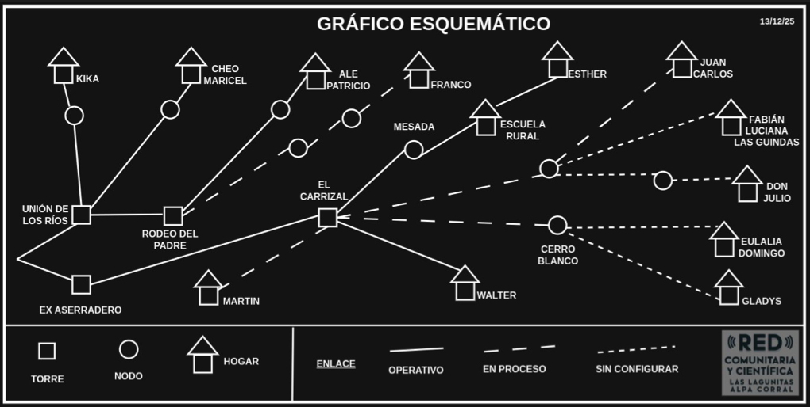

**Figura 1.** Topología esquematica de la Red Las Lagunitas

### Estado de los enlaces

Los enlaces troncales entre las torres principales (Unión de los Ríos, Rodeo del Padre y Unión de los Ríos, Ex Aserradero), el corredor hacia El Carrizal, Mesada y Escuela Rural, y los tramos hacia Kika, Cheo/Maricel y Walter, se encuentran operativos. Los enlaces hacia Ale/Patricio, Esther, Franco, Juan Carlos y Martín figuran en proceso de configuración. Los enlaces derivados del nodo Cerro Blanco hacia Las Guindas (Fabián y Luciana), Don Julio, y Eulalia y Domingo, y Gladys se encuentran sin configurar. Esta convivencia de tramos operativos, en proceso y sin configurar es consistente con lo registrado en el diagnóstico inicial de trabajos previos sobre la red, donde se identificaron equipos físicamente instalados pero sin configuración de enlace punto a punto, cableado dañado o sin protección, gabinetes mal instalados, torres y postes de calidad precaria, y baterías de paneles solares agotadas.

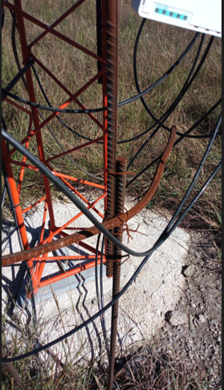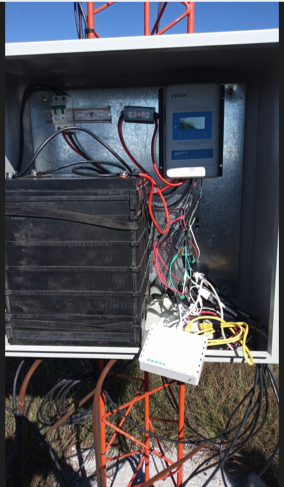 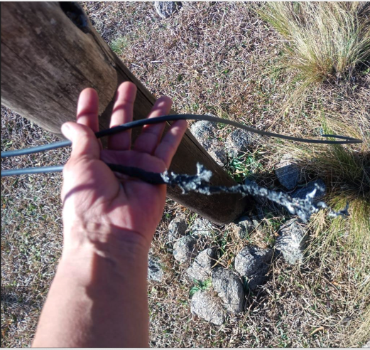

**Figura 2.** Estado precario de la infraestructura de la Red Las Lagunitas

### Esquema de administración y conectividad

La administración de la red se centraliza en un router Mikrotik (RB750/RB950) que gestiona el direccionamiento IP mediante DHCP y aplica reglas de firewall y NAT. La conectividad a Internet se provee mediante un enlace PPPoE otorgado por la Cooperativa de Alpa Corral, en un acuerdo comunitario que cede ancho de banda a cambio de infraestructura de fibra tendida por el proyecto. El acceso remoto para tareas de administración y diagnóstico se realiza mediante un servidor VPN L2TP/IPsec configurado sobre el Mikrotik, accesible mediante la aplicación nativa de Windows y el puerto de administración Winbox. Los routers domésticos AirCube se configuran en modo bridge, de forma que todo el direccionamiento quede centralizado en un router principal, simplificando el control de la red.

Este esquema permite hoy un diagnóstico remoto, pero exclusivamente manual y reactivo: un operador debe conectarse por VPN y revisar enlace por enlace desde el software propietario de Ubiquiti para determinar si hay una caída, sin que exista ningún mecanismo de verificación automática ni de alerta ante fallas.

### Alimentación energética

La mayoría de los nodos no dispone de acceso a la red eléctrica convencional y depende de sistemas autónomos de generación solar fotovoltaica con baterías VRLA (12 V, 55 Ah) y controladores de carga PWM. El dimensionamiento energético relevado en trabajos previos, considerando una irradiancia promedio de 5,5 horas pico de sol para la región y una eficiencia global del sistema del 70 %, arroja una autonomía de entre 1,6 y 2 días sin aporte solar según el tipo de antena alimentada. Esta limitación energética es relevante para el diseño del monitoreo: una caída de nodo puede deberse tanto a una falla de enlace como al agotamiento de la batería, por lo que el estado de alimentación debe tratarse como una variable de monitoreo independiente y no inferirse únicamente de la disponibilidad del enlace.

### Monitoreo existente y sus limitaciones

Es importante distinguir dos capas de monitoreo que hoy coexisten sobre esta red. Por un lado, existe una implementación piloto de sensores ambientales sobre tecnología LoRaWAN, un sensor de temperatura y humedad en el Nodo Mesada y un sensor ultrasónico de nivel instalado en el tanque de agua de la Escuela Rural, integrados mediante un gateway y publicados en la plataforma en la nube Datacake, que permite visualización en tiempo real, históricos y alertas por correo electrónico. Esta capa, sin embargo, mide variables ambientales y de servicio puntuales, y no releva el estado de la infraestructura de red en sí (disponibilidad de nodos, calidad de los enlaces inalámbricos, estado de los routers domésticos).

Para la infraestructura de red propiamente dicha, no existe ninguna herramienta de monitoreo automatizado. La detección de caídas de nodos o enlaces depende del aviso informal de los propios vecinos o de una revisión manual por parte de un administrador conectado remotamente. No hay historización de disponibilidad, no hay alertas configurables ante caídas, y no existe una vista centralizada del estado de la red completa.

### Problemas detectados

Del relevamiento se desprende un conjunto de problemas que fundamentan la necesidad de un sistema de monitoreo: enlaces instalados pero sin configurar o sin funcionamiento**,** ausencia de visibilidad remota consolidada sobre el estado de toda la red, dependencia total de la intervención manual y del aviso informal para detectar fallas, documentación históricamente dispersa y sin formato unificado, una infraestructura energética con márgenes de autonomía ajustados que puede generar caídas de servicio indistinguibles, a simple vista, de una falla de enlace, y controladores de carga solar (Epever LS-E) sin ninguna interfaz de comunicación remota, lo que impide relevar el estado de las baterías de forma electrónica con el hardware actualmente instalado.

### Variables críticas identificadas

A partir de este diagnóstico se identificaron las variables que el sistema de monitoreo debería relevar, evaluando en cada caso la viabilidad real con el equipamiento instalado. La disponibilidad de cada nodo (chequeo activo por ICMP) es monitoreable de forma universal, ya que no depende del fabricante ni del firmware: aplica tanto a los equipos airMAX como a los routers AirCube y al núcleo Mikrotik. La calidad del enlace punto a punto, señal recibida (RSSI), piso de ruido, calidad de canal (CCQ) y capacidad estimada, es relevable vía SNMP en los equipos de la familia airMAX (PowerBeam, LiteBeam, NanoStation/NanoLoco), que exponen estos valores a través del MIB propietario de Ubiquiti (UBNT-MIB); de hecho, existen templates ya disponibles para Zabbix que implementan esta integración sin necesidad de desarrollo adicional. La latencia se obtiene igualmente por ICMP, sin requerir instrumentación adicional en los equipos.

No ocurre lo mismo con los routers AirCube instalados en los hogares: al utilizar un firmware distinto al de la línea airMAX, sin soporte de SNMP ni una API documentada, sólo es posible relevar su disponibilidad por ping, sin acceso a métricas de calidad de enlace Wi-Fi doméstico.

En cuanto al estado de la alimentación autónoma (batería y aporte solar), el relevamiento de los controladores de carga instalados, Epever de la serie LS-E, determinó que estos equipos no cuentan con ningún puerto de comunicación (RS-485/Modbus, Bluetooth o Wi-Fi), a diferencia de otras series del mismo fabricante (LS-B, Tracer) que sí lo incorporan y son compatibles con medidores remotos. En consecuencia, esta variable no puede monitorearse de forma remota con el hardware actualmente desplegado en la red, y se documenta aquí como una limitación identificada durante el relevamiento: su incorporación al sistema de monitoreo queda planteada como trabajo futuro, condicionada al reemplazo de los controladores por un modelo con interfaz de comunicación.

Este conjunto de variables, depurado según la viabilidad real de relevamiento, es el que orientó, en la etapa siguiente, la evaluación de herramientas y el diseño del sistema de monitoreo basado en Zabbix.

## Fase 2: Evaluación de herramientas y selección

Siguiendo lo previsto en la Fase 2 del plan de trabajo, se evaluaron dos enfoques de distinto alcance para el monitoreo de la red: por un lado, un esquema basado en Syslog, centrado en la recolección centralizada de registros (logs) emitidos por los equipos de red; por otro, una plataforma de monitoreo integral como Zabbix.

Un servidor Syslog (también llamado colector o receptor de syslog) centraliza los mensajes que le envían los dispositivos de la red (routers, switches, servidores, aplicaciones) quienes deben tener configurada de antemano la dirección IP de ese servidor como destino de sus logs. El protocolo no contempla un mecanismo inverso: el servidor no puede solicitarle activamente el estado a un equipo, sólo recibe lo que el equipo decide enviarle. La mayoría de los sistemas Unix y fabricantes de red (como Cisco) incluyen su propio receptor, y también existen herramientas de terceros que agregan sobre esa recepción básica un panel con contadores y reglas de filtrado para distinguir advertencias y errores relevantes del resto del tráfico. Dado el volumen de mensajes que puede generar Syslog, la capacidad crítica de cualquier receptor es justamente esa: filtrar y priorizar correctamente lo que llega, ya que el protocolo en sí se limita a reenviar datos sin ninguna evaluación de estado ni generación de alertas propia (Paessler AG, s.f.).

Syslog resulta adecuado para centralizar eventos y mensajes de diagnóstico, pero por sí solo no ofrece detección activa de disponibilidad, visualización gráfica del estado de la red, ni generación de alertas configurables: cubrir esas funciones exigiría desarrollar herramientas adicionales sobre esa base. Zabbix, en cambio, integra en una única plataforma el chequeo activo y pasivo de disponibilidad, la recolección de métricas, un motor de disparadores (triggers) configurable, mapas de topología con reflejo de estado en tiempo real, y un panel (dashboard) web con widgets gráficos, sin necesidad de desarrollo adicional.

Ambas alternativas son software libre, por lo que la decisión no respondió a una diferencia de costo sino de alcance funcional y de esfuerzo de implementación. Considerando los recursos técnicos y comunitarios disponibles, una organización sin equipo técnico dedicado, para la cual una plataforma única, autocontenida y con una curva de aprendizaje razonable resulta más sostenible que ensamblar y mantener herramientas adicionales sobre un esquema de logs, se seleccionó Zabbix como herramienta de monitoreo para la Red Las Lagunitas.

### Ejemplo comparativo: la misma caída de enlace, vista por cada sistema

Con un esquema Syslog: el Mikrotik de Torre Walter (RouterOS soporta el envío de logs a un servidor Syslog remoto) emite una línea de texto cuando el enlace cae, del estilo:

14:32:07 interface,info,link-down ether2 link down

Ese registro queda almacenado en el servidor de logs, mezclado con el resto del tráfico de eventos de la red. Por sí solo no dispara ninguna acción: para que alguien se entere de la caída, un administrador tendría que estar revisando el archivo de logs en tiempo real, o bien habría que desarrollar un componente adicional (un script que parsee el log, detecte el patrón "link down" y dispare un aviso), exactamente la limitación señalada en el párrafo anterior.

Con Zabbix: el mismo tipo de evento, en este caso registrado realmente en el laboratorio, con el nodo Kika caído, aparece en el dashboard sin que nadie tenga que revisar ningún archivo de texto. El widget "Alertas activas" lista el problema con el host afectado, la descripción del trigger ("Nodo caído: Kika"), la severidad resaltada en rojo y la duración transcurrida en tiempo real (52m 29s y contando desde que se disparó). En paralelo, el mapa de topología marca al nodo en rojo con la misma etiqueta, y la tabla "Top hosts" lo distingue de inmediato del resto mostrándolo como "Caído (0)", con 0 ms de latencia. Ninguna de estas tres vistas requiere que un operador esté interpretando líneas de log: el problema es visible apenas se abre el dashboard, con hora de inicio y severidad ya clasificadas.

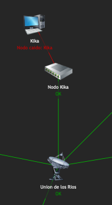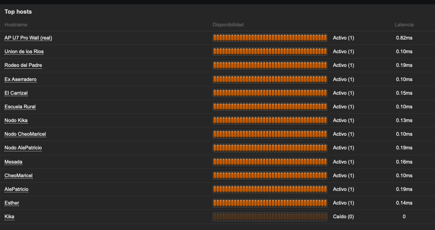

**Figura 3.** Detección y alerta de la caída del host Kika

## Fase 3: Implementación del sistema de monitoreo

Es importante contextualizar el alcance de esta implementación: la construcción de la red de Las Lagunitas dependía de un proyecto de conectividad financiado externamente (convocatoria BOLT de ISOC Argentina, 2024), cuya ejecución no se completó según lo planificado y se encuentra en proceso. Esta circunstancia, documentada en la presentación de la conferencia BattleMesh v18 (Caminati, Bellomo y Campoamor, 2026), es la que fundamenta que la cátedra autorizara resolver el presente trabajo mediante un laboratorio de monitoreo simulado en lugar de un despliegue directo sobre la infraestructura productiva, tal como se adelantó en la introducción de "Relevamiento y análisis del estado actual".

La implementación se resolvió con un enfoque de **configuración como código**: toda la configuración de Zabbix (equipos, plantillas, disparadores, dependencias, mapa de topología, servicios, dashboards y alertas) se genera automáticamente a partir de un inventario de la red, de modo que el mismo proyecto sirve tanto para el laboratorio como para el despliegue productivo. Esta sección describe la arquitectura, el inventario y su aprovisionamiento, los métodos de recolección y las métricas de cada tipo de equipo, los disparadores de alarma, las herramientas de visualización y de reportería desarrolladas y las pruebas de validación. Todas las capturas corresponden al entorno real de laboratorio, con Zabbix 7.0.30 LTS.

**Tabla 1.** Resumen de la implementación en el laboratorio

| Elemento | Cantidad |
|:---|----|
| Equipos en el inventario | 33 equipos en 28 sitios |
| Equipos monitoreados activamente | 21 (los 12 restantes, con tramo en proceso o sin configurar, quedan registrados y deshabilitados) |
| Plantillas (templates) propias | 5 |
| Métricas (ítems) recolectadas | 685, de las cuales 523 se actualizan cada 10 s; 0 no soportadas |
| Disparadores (triggers) activos | 297 (348 contando los equipos aún deshabilitados) |
| Disparadores con dependencias | 98 |
| Dashboards | 1 centro de monitoreo de 5 páginas y 32 widgets, más 1 dashboard por plantilla |
| Mapa de topología | 28 elementos y 26 enlaces |
| Servicios y SLA | 22 servicios y 1 SLA mensual con objetivo de 99,5 % |
| Módulos propios del frontend | 2 (widget «Red Las Lagunitas» y reporte «Disponibilidad de la red») |

### Arquitectura general del sistema de monitoreo

#### Arquitectura del entorno de laboratorio

El laboratorio se ejecuta sobre una Mac con procesador Apple Silicon, con Colima como motor de contenedores Docker. El núcleo de Zabbix 7.0.30 se compone de cuatro contenedores: **Zabbix Server** (recolección de datos y evaluación de disparadores), **MySQL 8** (configuración e historial), **Zabbix Frontend** (interfaz web, accesible por HTTP en el puerto 8090, con los módulos propios montados) y **Zabbix Agent 2** (automonitoreo del propio servidor). La red comunitaria se representa en una red Docker dedicada (10.50.0.0/24), en la que cada equipo operativo del inventario es un contenedor con la misma dirección IP que tiene asignada en el inventario.

A diferencia del primer laboratorio, los equipos simulados ya no ejecutan agentes Zabbix: se monitorean exactamente como se monitorearán los equipos reales, **sin agente** (*agentless*). Todos responden ICMP, y los que representan radios Ubiquiti airMAX y el router Mikrotik ejecutan un agente SNMP simulado (snmpsim) que expone los mismos identificadores (OID) de los MIB del fabricante: UBNT-AirMAX-MIB, MIKROTIK-MIB, IF-MIB y HOST-RESOURCES-MIB. Esto permite validar plantillas, disparadores y visualizaciones con los mismos datos que entregarán los equipos de campo, e incluso simular fallas (señal débil, interferencia, batería baja, pérdida del enlace a Internet) sin acceso físico a la red.

El punto de acceso real **UniFi U7 Pro Wall** (192.168.1.113) se integra por la API REST de UniFi Network, consultada con una clave de API a través del controlador UniFi OS Server, y por ICMP. Durante las pruebas se detectó que la red virtual de Colima responde el ping dirigido a cualquier dirección externa, incluso a direcciones inexistentes, lo que invalidaba la medición de disponibilidad y latencia del AP desde el servidor. Se resolvió con una **sonda ICMP** que se ejecuta en el equipo anfitrión y envía los resultados a Zabbix, con las mismas métricas y disparadores que en producción, donde esta limitación no existe.

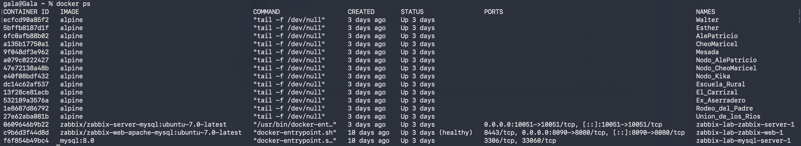

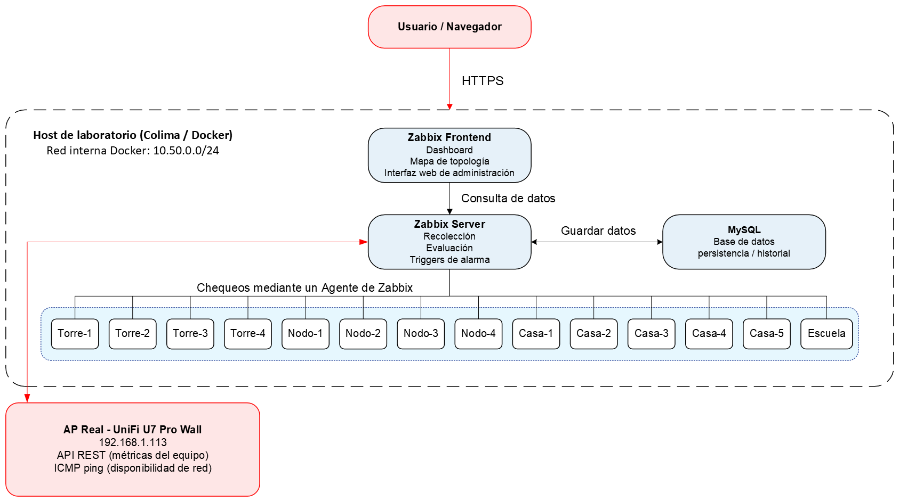

**Figura 4.** Arquitectura del entorno de laboratorio

#### Arquitectura prevista para el entorno de producción

En producción, Zabbix Server, MySQL y el frontend se despliegan con Docker Compose sobre un servidor Linux (Ubuntu Server LTS) virtualizado en **Proxmox VE** (máquina virtual o contenedor LXC) en la **Cooperativa de Alpa Corral**, que cuenta con alimentación eléctrica estable. El frontend se publica con HTTPS mediante un proxy inverso (Caddy), y la administración remota se realiza a través de una **VPN L2TP/IPsec** terminada en el router Mikrotik de la red. Los equipos reales se monitorean sin agente: ICMP para disponibilidad, latencia y pérdida; SNMP v2c para los radios airMAX y el Mikrotik; y la API de UniFi Network para los access points UniFi.

Se suma un circuito de respaldo ausente en el entorno simulado: una tarea programada ejecuta diariamente un volcado comprimido de la base de datos y la exportación de la configuración, con retención de 14 días, y copia el resultado a almacenamiento en la nube (Backblaze B2 o Google Drive). Como toda la configuración se genera desde el inventario, el pase a producción consiste en completar las direcciones IP reales en el inventario de producción y ejecutar el aprovisionamiento; el procedimiento completo está en la Guía de implementación.

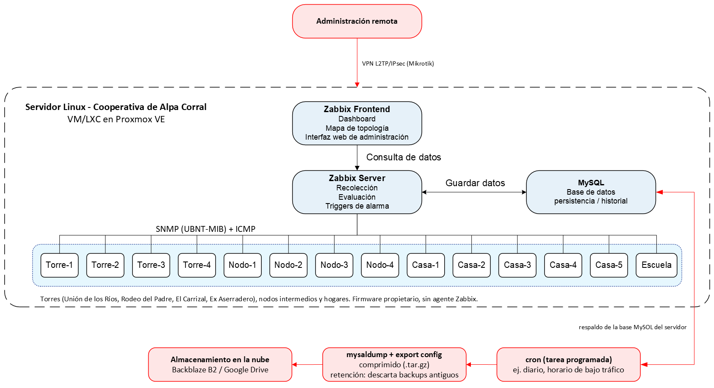

**Figura 5.** Arquitectura prevista para el entorno de producción

### Configuración como código: inventario y aprovisionamiento

El **inventario de la red** (un archivo YAML) es la fuente única de verdad. Cada sitio (gateway, torre, nodo, hogar o institución) declara su nombre, rol, dirección IP, **equipo padre** del que depende su conectividad, estado del tramo (operativo, en proceso o sin configurar), **perfiles de monitoreo** (icmp, airos_snmp, mikrotik_snmp, unifi_api) y posición en el mapa. Cada sitio puede incluir, además, los equipos secundarios instalados en él (radio AP, estación, router).

La herramienta de línea de comandos desarrollada (**bin/lagunitas**, en Python) lee el inventario y, mediante la API JSON-RPC de Zabbix, crea o actualiza todos los objetos. Es **idempotente**: puede ejecutarse las veces que haga falta sin duplicar nada, por lo que cualquier cambio en la red (alta, baja, cambio de IP o de padre) se aplica editando el inventario y volviendo a ejecutarla. En cada ejecución genera:

- Las **plantillas** propias, con sus métricas, disparadores, reglas de descubrimiento y dashboards de equipo.

- Los **equipos** (hosts), con sus grupos por rol, etiquetas (rol, función, estado del tramo), inventario (modelo y equipo instalado), interfaces y macros.

- Las **dependencias** padre → hijo entre los disparadores de caída.

- El **mapa de topología**, con íconos por rol, enlaces con el estilo del estado del tramo y leyenda.

- El **árbol de servicios** y el **SLA** mensual.

- Los **módulos propios** del frontend y el **dashboard** principal.

- El **grupo de operadores**, la **acción de notificación** y, opcionalmente, el canal de Telegram.

Los equipos cuyo tramo está «en proceso» o «sin configurar» se registran deshabilitados: aparecen en el mapa y en los listados como «No monitoreados» y se habilitan cambiando su estado en el inventario. La herramienta incluye además comandos para validar el inventario, verificar la salud de la configuración, exportarla a YAML, diagnosticar el SNMP de un equipo antes de integrarlo y consultar los identificadores de UniFi.

**Tabla 2.** Equipos del inventario por rol

| Rol | En el inventario | Monitoreados | Perfiles de monitoreo |
|:---|----|----|----|
| Gateway (salida a Internet) | 1 | 1 | icmp + mikrotik_snmp |
| Torres (backbone) | 4 | 4 | icmp + airos_snmp (3 radios) / icmp (1) |
| Nodos intermedios | 10 | 5 | icmp + airos_snmp (2 radios) / icmp |
| Hogares | 14 | 7 | icmp + airos_snmp (2 radios) / icmp |
| Instituciones | 3 | 3 | icmp + airos_snmp (2 radios) / icmp |
| Access point UniFi (real) | 1 | 1 | icmp (sonda en el laboratorio) + unifi_api |
| **Total** | **33** | **21** |  |

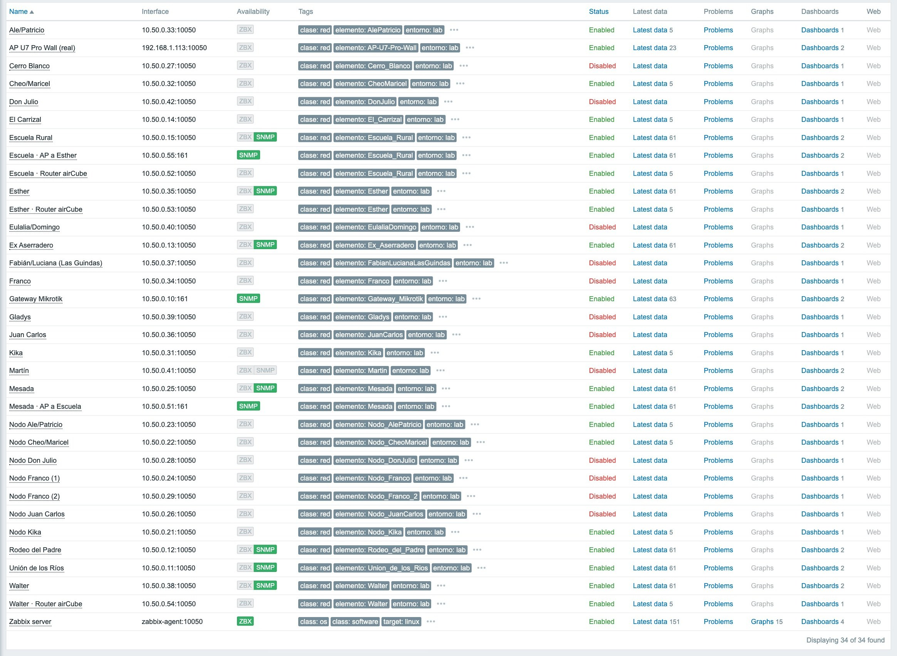

**Figura 6.** Equipos registrados en Zabbix a partir del inventario: interfaz, disponibilidad ICMP/SNMP, etiquetas y estado (deshabilitados los tramos en proceso o sin configurar)

### Métodos de recolección y plantillas

El monitoreo se organiza en cinco plantillas propias. Cada equipo recibe las plantillas que corresponden a sus perfiles: todos tienen disponibilidad por ICMP y, según el hardware, se agregan SNMP (radios airMAX y router Mikrotik) o la API de UniFi (access points UniFi). Las plantillas airMAX y Mikrotik incluyen **reglas de descubrimiento** (LLD) que crean automáticamente las métricas y los disparadores de cada interfaz, de cada estación asociada a un radio y del enlace a Internet.

**Tabla 3.** Plantillas propias

| Plantilla | Aplica a | Método | Métricas | Disparadores | Descubrimientos |
|:---|----|----|----|----|----|
| Disponibilidad ICMP | 32 equipos | ICMP (fping del servidor) | 5 | 3 | — |
| Disponibilidad ICMP - sonda externa | AP del laboratorio | Sonda ICMP del anfitrión (solo laboratorio) | 5 | 4 | — |
| Ubiquiti airMAX por SNMP | 10 radios | SNMP v2c | 28 + 16 por interfaz/estación | 15 + 3 por interfaz/estación | Interfaces y estaciones |
| Mikrotik por SNMP | Gateway | SNMP v2c | 15 + 7 por interfaz/WAN | 10 + 3 por interfaz/WAN | Interfaces y enlace a Internet |
| AP UniFi por API | 1 access point | API REST de UniFi Network | 18 | 10 | — |

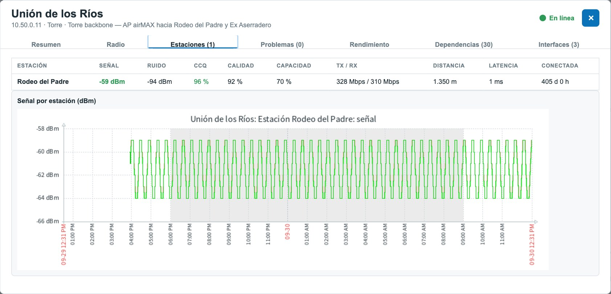

**Figura 7.** Plantillas propias en Zabbix, con sus equipos, métricas, disparadores, dashboards y descubrimientos

#### Frecuencia de actualización

Todas las mediciones dinámicas se actualizan **cada 10 segundos**. El valor se define en una única macro global, {\$LAGUNITAS.INTERVALO}, de modo que la carga de toda la red se puede ajustar (por ejemplo, a 30 s si los enlaces de radio se saturan) sin volver a aprovisionar. Los disparadores se evalúan con cada dato nuevo, por lo que también reaccionan cada 10 s; sus ventanas (por ejemplo, «promedio de 5 minutos») están expresadas en tiempo y no dependen del intervalo.

**Tabla 4.** Frecuencia de actualización

| Qué | Frecuencia |
|:---|----|
| Mediciones de todos los equipos (ICMP, SNMP, API UniFi, interfaces y estaciones) | 10 s |
| Disponibilidad de las últimas 24 h y 7 días (métricas calculadas) | 1 min |
| Datos estáticos (modelo, firmware, SSID, antena, número de serie, velocidad de interfaz) | 1 h |
| Descubrimiento de estaciones y del enlace a Internet / de interfaces | 10 min / 1 h |
| Widgets de los dashboards y pantallas del frontend | 10 s |

#### Disponibilidad por ICMP (todos los equipos)

Es la base del monitoreo y se aplica a cualquier equipo con dirección IP, incluidos los routers airCube de los hogares, que no ofrecen SNMP ni una API documentada. El servidor envía pings (fping) a cada equipo y registra:

**Tabla 5.** Métricas de disponibilidad ICMP

| Métrica | Descripción | Frecuencia |
|:---|----|----|
| Disponibilidad (ICMP) | 1 si el equipo responde, 0 si no | 10 s |
| Latencia (ICMP) | Tiempo de ida y vuelta promedio | 10 s |
| Pérdida de paquetes (ICMP) | Porcentaje de paquetes sin respuesta | 10 s |
| Disponibilidad últimas 24 h | Promedio de la disponibilidad (%) | 1 min |
| Disponibilidad últimos 7 días | Promedio de la disponibilidad (%) | 1 min |

#### Radios Ubiquiti airMAX por SNMP

Los radios de la red (PowerBeam, LiteBeam, NanoStation y NanoLoco) se consultan por SNMP v2c con el MIB propietario de Ubiquiti. Es el grupo con mayor detalle, porque la calidad del enlace inalámbrico es la principal causa de degradación del servicio en una red de este tipo:

**Tabla 6.** Métricas de los radios airMAX

| Grupo | Métricas |
|:---|----|
| Enlace inalámbrico | Señal, piso de ruido, SNR, RSSI, CCQ, calidad y capacidad airMAX, tasas de modulación TX/RX, estaciones asociadas |
| Configuración de radio | Modo (AP o estación), frecuencia, ancho de canal, potencia de transmisión, distancia configurada, DFS, antena, SSID |
| Sistema | Uso de CPU y de memoria, temperatura, uptime, modelo, firmware airOS, nombre |
| Interfaces (descubiertas) | Estado, tráfico entrante y saliente, errores de entrada y de salida, velocidad |
| Estaciones asociadas (descubiertas) | Por cada equipo del otro extremo del enlace: señal, ruido, CCQ, calidad y capacidad airMAX, tasas TX/RX, distancia, latencia y tiempo conectada |
| Agente | Disponibilidad del agente SNMP |

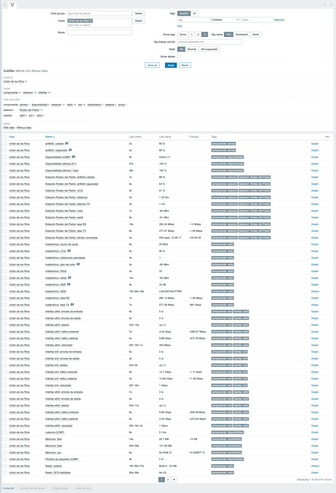

**Figura 8.** Últimos datos de la torre Unión de los Ríos: métricas SNMP del radio airMAX

#### Router Mikrotik por SNMP

El router Mikrotik del gateway concentra la salida a Internet y, en los sitios con energía solar, informa el estado de la alimentación. Se monitorea con MIKROTIK-MIB e IF-MIB:

**Tabla 7.** Métricas del router Mikrotik

| Grupo | Métricas |
|:---|----|
| Energía | Voltaje de alimentación (batería), temperatura de placa y de CPU |
| Servicio | Clientes DHCP activos; estado del enlace a Internet (PPPoE), descubierto automáticamente |
| Sistema | Uso de CPU y de memoria, uptime, modelo, número de serie, versión de RouterOS y de RouterBOOT |
| Interfaces (descubiertas) | Estado, tráfico, errores y velocidad de cada interfaz |

#### Access points UniFi por API

Los access points UniFi no se consultan por SNMP sino por la API de integración de UniFi Network, con una clave de API guardada como macro secreta. Tres consultas HTTP (estadísticas, datos del dispositivo y clientes del sitio) devuelven documentos JSON de los que se extraen, mediante preprocesamiento, 14 métricas: estado informado por el controlador, uso de CPU y de memoria, carga, uptime, clientes conectados, tráfico del uplink (TX/RX), reintentos de transmisión por banda (2,4, 5 y 6 GHz), versión de firmware y modelo. Se controla además que el controlador sea accesible.

### Disparadores de alarma y dependencias

Las plantillas definen **42 disparadores** y **6 prototipos** de disparador (que se replican por cada interfaz, estación o enlace descubierto). Aplicados sobre los 21 equipos monitoreados resultan **297 disparadores activos**; con los equipos aún deshabilitados, el total configurado es de 348. Todos los umbrales son **macros**, ajustables para toda la red o para un equipo puntual (por ejemplo, un enlace largo con más latencia).

**Tabla 8.** Disparadores activos por severidad

| Severidad | Cantidad | Uso |
|:---|----|----|
| Disaster | 1 | Pérdida del enlace a Internet |
| High | 23 | Equipo sin respuesta, AP fuera de línea, voltaje crítico |
| Average | 65 | Sin datos SNMP/API, interfaz sin enlace, radio sin estaciones, señal crítica |
| Warning | 168 | Degradación: señal, ruido, CCQ, pérdida, latencia, recursos, temperatura, energía |
| Information | 40 | Cambios: reinicio, firmware, frecuencia de radio |
| **Total** | **297** |  |

**Tabla 9.** Disparadores definidos en las plantillas

| Plantilla | Disparador | Severidad |
|:---|----|----|
| ICMP | Sin respuesta (ICMP) durante 90 s | High |
| ICMP | Pérdida de paquetes alta (mínimo de 5 min \> 20 %) | Warning |
| ICMP | Latencia alta (promedio de 5 min \> 150 ms) | Warning |
| ICMP - sonda | La sonda ICMP no envía datos (3 min) | Warning |
| airMAX | Radio AP sin estaciones asociadas | Average |
| airMAX | Sin datos SNMP | Average |
| airMAX | Señal crítica | Average |
| airMAX | Señal débil · SNR bajo · CCQ bajo · ruido alto en el canal · calidad airMAX baja | Warning |
| airMAX | Uso de CPU alto · uso de memoria alto · temperatura alta | Warning |
| airMAX | Capacidad airMAX baja · cambió la frecuencia · cambió el firmware · el equipo se reinició | Information |
| airMAX (por interfaz) | Interfaz sin enlace | Average |
| airMAX (por interfaz / estación) | Errores en la interfaz · señal débil de la estación | Warning |
| Mikrotik | Voltaje crítico | High |
| Mikrotik | Sin datos SNMP · voltaje excesivo | Average |
| Mikrotik | Voltaje bajo · sin clientes DHCP · uso de CPU / memoria alto · temperatura alta | Warning |
| Mikrotik | Cambió la versión de RouterOS · el router se reinició | Information |
| Mikrotik (por WAN) | Sin enlace a Internet | Disaster |
| Mikrotik (por interfaz) | Interfaz sin enlace · errores en la interfaz | Average · Warning |
| UniFi | AP fuera de línea según UniFi | High |
| UniFi | Sin datos de la API de UniFi · controlador UniFi no accesible (3 min) | Average |
| UniFi | Uso de CPU / memoria alto · reintentos altos en 2,4 / 5 / 6 GHz | Warning |
| UniFi | Cambió la versión de firmware · el AP se reinició | Information |

**Dependencias.** Cada equipo declara en el inventario su padre, y el aprovisionamiento convierte esa relación en dependencias entre disparadores: el disparador de caída de cada equipo depende del de su padre, y las alertas de SNMP o de la API de un equipo dependen de su propia caída (98 disparadores con dependencias). Así, si cae una torre, Zabbix alerta **solo por la torre** y suprime las alertas de todos los nodos y hogares aguas abajo, que se muestran como «Sin servicio» en lugar de generar una tormenta de alarmas. Es la diferencia central con un esquema de logs como Syslog, en el que cada equipo emitiría su propio evento sin relación con los demás.

### Visualización

#### Dashboard «Las Lagunitas - Centro de monitoreo»

Es el punto de entrada del operador. Tiene cinco páginas con 32 widgets que se refrescan cada 10 segundos:

- **Estado de la red:** panal con un hexágono por equipo (verde activo, rojo caído), problemas por severidad, mapa de topología y alertas activas.

- **Equipos:** widget propio con el estado detallado de toda la red.

- **Detalle por equipo:** navegador de equipos agrupado por rol; al elegir uno, todos los widgets de la página muestran sus datos (comunicación entre widgets de Zabbix 7).

- **AP UniFi:** métricas del access point real.

- **SLA:** cumplimiento mensual y ranking de disponibilidad de 7 días.

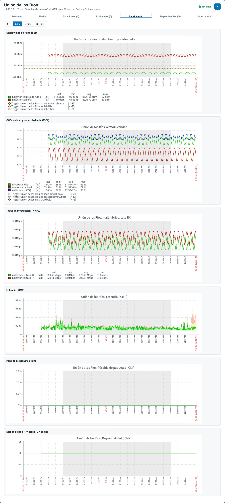

**Figura 9.** Página «Estado de la red»: panal de equipos, problemas por severidad, mapa de topología y alertas activas

#### Widget propio «Red Las Lagunitas»

Zabbix no ofrece una vista que combine disponibilidad, calidad de enlace, energía y dependencias por equipo, por lo que se desarrolló un **módulo de widget propio** (PHP y JavaScript sobre el framework de módulos de Zabbix 7). Muestra tarjetas de resumen (total, en línea, advertencias, caídos, sin servicio, sin datos y no monitoreados), un buscador, filtros por estado y por rol, y una tabla por rol con disponibilidad de 24 h, latencia, pérdida, «enlace / energía» (señal y CCQ en los radios; voltaje y clientes DHCP en el router), equipo del que depende y problemas activos. El estado de cada equipo distingue entre **Caído** (falla propia) y **Sin servicio** (sin conectividad porque cayó un equipo del que depende).

**Figura 10.** Página «Equipos»: widget propio con tarjetas de resumen, filtros y tablas por rol

Al hacer clic en un equipo se abre su **detalle**, con pestañas que dependen del tipo de equipo: *Resumen*, *Radio* y *Estaciones* (radios airMAX), *Router y energía* (Mikrotik), *UniFi* (access points), *Interfaces*, *Problemas*, *Rendimiento* (gráficos de 1 h a 30 días) y *Dependencias* (equipos que quedarían sin servicio si este cae). Desde el detalle se accede también al reporte técnico, al dashboard del equipo y a sus últimos datos.

**Figura 11.** Detalle de la torre Unión de los Ríos: pestaña «Resumen»

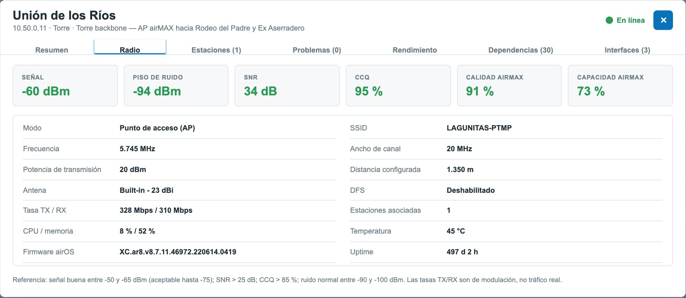

**Figura 12.** Pestaña «Radio»: calidad del enlace y configuración del radio airMAX, con valores de referencia

**Figura 13.** Pestaña «Estaciones»: equipo del otro extremo del enlace y su calidad

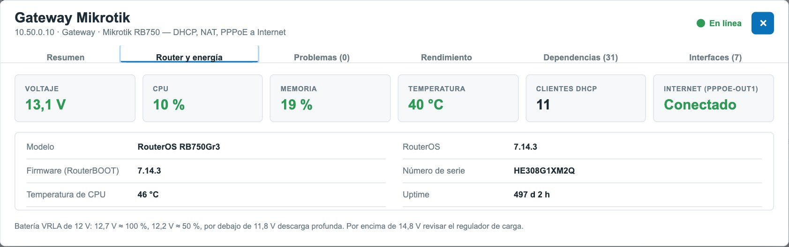

**Figura 14.** Detalle del Gateway Mikrotik: pestaña «Router y energía» (voltaje de batería, recursos, clientes DHCP y enlace a Internet)

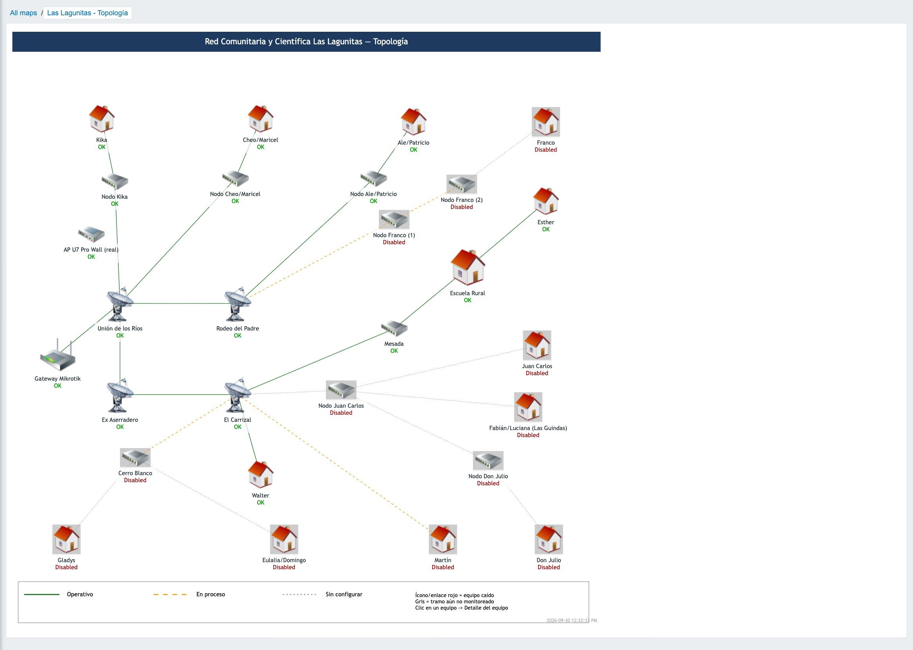

**Figura 15.** Pestaña «Rendimiento»: gráficos históricos de las métricas principales

**Figura 16.** Pestaña «Dependencias»: equipos que quedan sin servicio si cae la torre

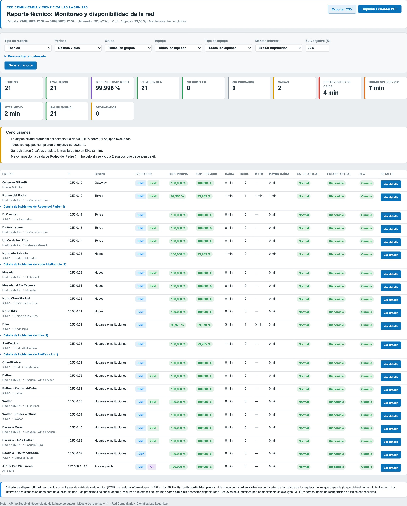

**Figura 17.** Detalle del AP UniFi U7 Pro Wall: pestaña «UniFi» con los datos informados por el controlador

#### Detalle por equipo, AP UniFi y SLA

**Figura 18.** Página «Detalle por equipo»: navegador por rol y widgets vinculados al equipo elegido

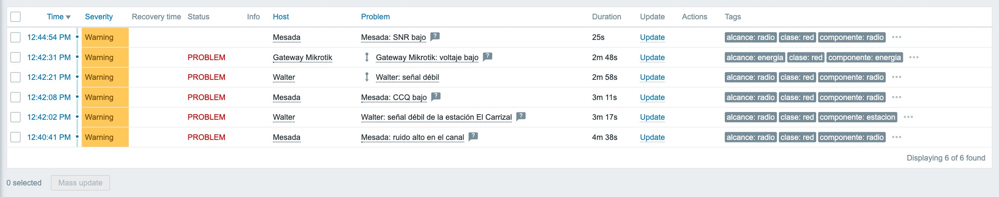

**Figura 19.** Página «AP UniFi»: estado, recursos, clientes, tráfico, reintentos por banda, latencia y disponibilidad

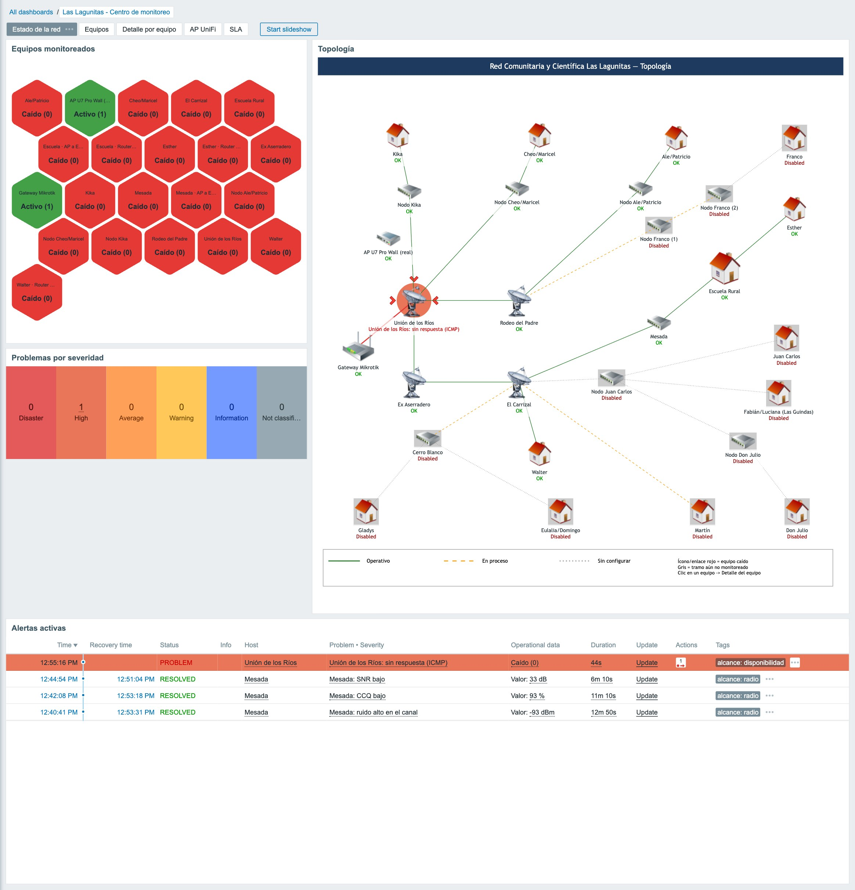

**Figura 20.** Página «SLA»: cumplimiento mensual por equipo y ranking de disponibilidad de 7 días

#### Mapa de topología

El mapa se genera desde el inventario con los 28 sitios y sus 26 enlaces. Cada ícono representa el rol del equipo (gateway, torre, nodo, hogar) y cada enlace toma el estilo del estado del tramo: línea continua verde para los operativos, discontinua naranja para los que están en proceso y punteada gris para los que aún no están configurados. Cuando un equipo cae, su ícono y su enlace pasan a rojo.

**Figura 21.** Mapa de topología de la Red Las Lagunitas

#### Dashboards por equipo

Cada plantilla incluye su propio dashboard, que Zabbix muestra para cualquier equipo que la use (*Monitoring → Hosts → Dashboards*). La plantilla ICMP aporta la página «Detalle del equipo» (estado, disponibilidad, latencia y pérdida) y cada plantilla específica agrega la suya: en los radios airMAX, «Detalle de radio airMAX», con indicadores de señal, SNR, CCQ y capacidad, la configuración de radio y gráficos de señal y ruido, CCQ, tasas de modulación y tráfico por interfaz.

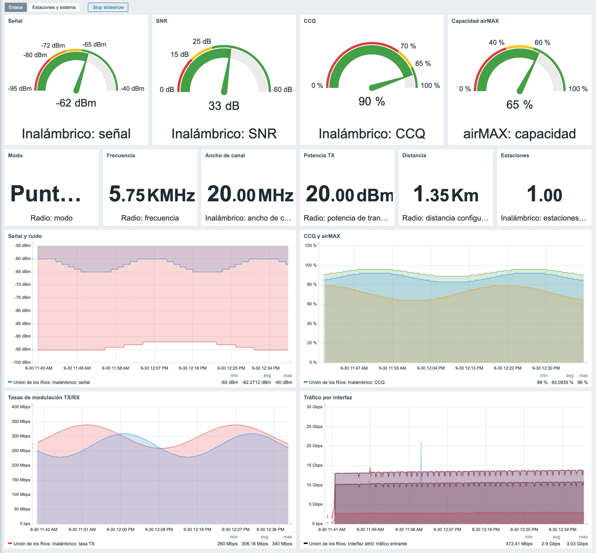

**Figura 22.** Dashboard de equipo de la torre Unión de los Ríos: página «Detalle de radio airMAX» (los valores de tráfico son simulados)

### Servicios y SLA

Se construyó un árbol de **22 servicios**: la red completa como raíz, un servicio por rol y un servicio por equipo monitoreado, cada uno asociado a su disparador de caída. Sobre ese árbol se definió un **SLA mensual con objetivo de 99,5 %**, que Zabbix calcula de forma continua y presenta en el reporte de SLA nativo.

**Figura 23.** Reporte de SLA nativo de Zabbix para el SLA mensual de la red

### Reportería

Para el análisis técnico y la rendición de cuentas se desarrolló un **módulo de reportes propio** (menú *Reports → Disponibilidad de la red*). Su diseño se inspiró en el proyecto de código abierto Reportes-Zabbix de Willian Tola (lab24com), que sirvió de referencia para mejorar la primera versión del sistema; el módulo se implementó desde cero para Zabbix 7.0 y se adaptó a las necesidades de esta red, en particular a las dependencias entre equipos.

El reporte se consulta con **filtros** de tipo de reporte (técnico o gerencial), período, grupo, equipo, tipo de equipo, tratamiento de los mantenimientos y SLA objetivo. Presenta:

- **Indicadores:** equipos evaluados, disponibilidad media, cantidad que cumple y no cumple el SLA, caídas, horas-equipo de caída, horas sin servicio, tiempo medio de recuperación (MTTR) y salud operativa.

- **Conclusiones automáticas:** disponibilidad promedio, incumplimientos, caída más larga y la de mayor impacto (cuántos equipos dejó sin servicio).

- **Tabla por equipo:** indicador usado (ICMP, SNMP, API), **disponibilidad propia** (falla del equipo) y **disponibilidad del servicio** (lo que efectivamente vivió el usuario, incluyendo caídas de los equipos de los que depende), caída, incidentes, MTTR, mayor caída, salud y estado actuales y cumplimiento del SLA, con el detalle de cada incidente desplegable.

- **Exportación** a CSV y a PDF.

El criterio de cálculo usa el disparador de caída de cada equipo; los intervalos simultáneos se unen para no duplicar tiempo, los eventos suprimidos por mantenimiento pueden excluirse y los problemas de señal, energía o recursos se informan como *salud* sin descontar disponibilidad.

**Figura 24.** Reporte «Disponibilidad de la red» (últimos 7 días)

Desde cada fila se accede al **detalle técnico del equipo**: indicadores del período, conclusiones y recomendaciones, datos del equipo y el **comportamiento de cada métrica** (valor actual, promedio y extremo; gráfico de tendencia con las líneas de umbral; horas fuera de umbral de advertencia y crítico), el estado de las interfaces, las estaciones asociadas y los problemas del período agrupados, con detección de *flapping* (alertas que aparecen y desaparecen repetidamente).

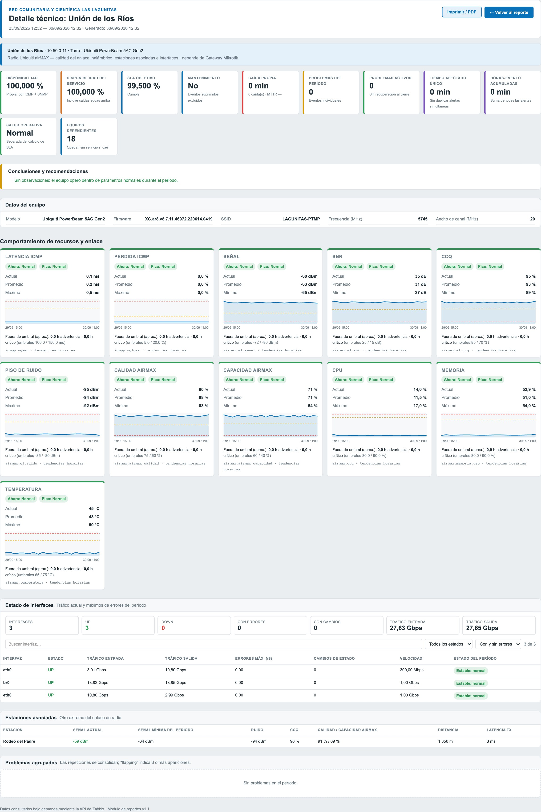

**Figura 25.** Detalle técnico de la torre Unión de los Ríos (radio airMAX)

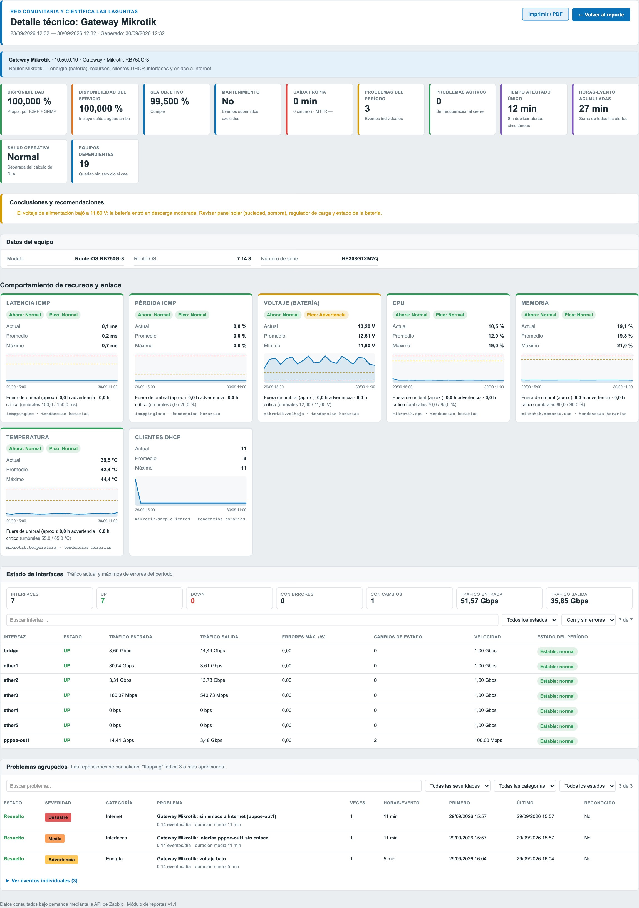

**Figura 26.** Detalle técnico del Gateway Mikrotik (energía, recursos, clientes DHCP e interfaces)

### Alertas y notificaciones

Los problemas con severidad *Average* o superior disparan la acción **«Las Lagunitas - Notificar caídas»**, que avisa al grupo de usuarios **Operadores Las Lagunitas** por los medios configurados; se dejó preparado el envío por **Telegram**, que se habilita cargando el token del bot. Gracias a las dependencias, una caída troncal produce una sola notificación. Los operadores registran lo actuado reconociendo el problema (*acknowledge*), y antes de trabajar en una torre se crea un **mantenimiento programado** para no generar alertas.

### Validación

El sistema se validó con pruebas controladas sobre el laboratorio, provocando fallas reales en los equipos simulados y verificando la respuesta de extremo a extremo. En la primera prueba se aplicaron, mediante el simulador SNMP, tres escenarios de degradación simultáneos: **señal débil** en el radio del hogar Walter, **interferencia** en el radio del nodo Mesada y **batería baja** en el Gateway Mikrotik. Entre 6 y 11 minutos después (el tiempo que tardan en superar el umbral los promedios de 10 y 15 minutos que evitan falsas alarmas por variaciones momentáneas) se generaron seis alertas de severidad *Warning*: señal débil del radio y de su estación asociada, ruido alto, CCQ bajo y SNR bajo en Mesada, y voltaje bajo en el gateway. Al restaurar los valores normales, todos los problemas se cerraron automáticamente en menos de 10 minutos, sin intervención del operador.

**Figura 27.** Alertas generadas por los escenarios de falla simulados por SNMP

La segunda prueba simuló una **caída troncal**: se detuvo la torre Unión de los Ríos, lo que deja sin camino a los 18 equipos que dependen de ella (torres, nodos, hogares e institución). Zabbix detectó la caída en **96 segundos** y generó **una única alerta** de severidad *High* («Unión de los Ríos: sin respuesta (ICMP)») y una única notificación, aunque 19 equipos dejaron de responder: las alertas de los equipos aguas abajo quedaron suprimidas por las dependencias. En el dashboard, el panal mostró los 19 equipos en rojo, el mapa marcó la torre y su enlace en rojo, y el widget «Equipos» distinguió la torre «Caída» de los equipos «Sin servicio». Al volver a encender los contenedores, el problema se cerró solo en 7 segundos y todos los indicadores retornaron a su estado normal.

**Figura 28.** Caída troncal simulada: la torre Unión de los Ríos en rojo en el panal y en el mapa

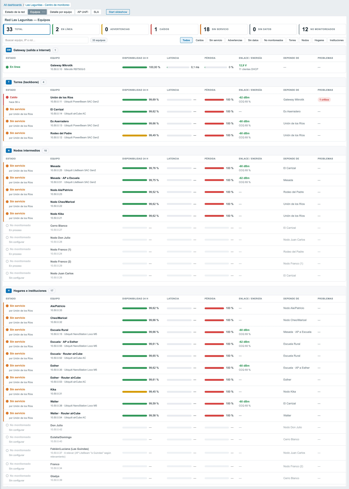

**Figura 29.** Caída troncal: la torre figura «Caída» y los equipos aguas abajo «Sin servicio»

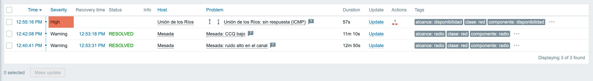

**Figura 30.** Caída troncal: una única alerta activa gracias a las dependencias

Con el access point real se verificaron además la detección de su caída, la de la falta de acceso al controlador UniFi y la de la detención de la sonda ICMP. Al finalizar cada prueba, los equipos recuperaron su estado normal y los problemas se cerraron automáticamente.

### Seguridad y respaldo

- Las credenciales (base de datos, usuario administrador, clave de API de UniFi, comunidad SNMP, token de Telegram) se guardan en un archivo de entorno con permisos restringidos, fuera del control de versiones; la clave de UniFi se carga en Zabbix como **macro secreta**.

- El código y la documentación se versionan en un **repositorio privado de GitHub**. Una alerta del servicio de detección de secretos sobre credenciales de laboratorio en un commit inicial llevó a rotar esas claves.

- En producción, el frontend se publica solo por **HTTPS**, se usa una comunidad SNMP propia y la administración remota se hace por VPN.

- Los scripts de **respaldo y restauración** generan un volcado comprimido y validado de la base y la exportación de la configuración, con retención configurable.

## Fase 4: Documentación, capacitación y cierre

Como cierre del trabajo se elaboró la documentación técnica necesaria para desplegar, operar y mantener el sistema de forma autónoma. Toda la documentación se escribe en Markdown dentro del repositorio del proyecto, de modo que se versiona junto con el código, y se generan automáticamente versiones en Word con la portada institucional:

**Tabla 10.** Documentación entregada

| Documento | Contenido |
|:---|----|
| Guía de implementación | Arquitectura y requisitos de producción, instalación del servidor paso a paso, configuración de secretos, HTTPS, aprovisionamiento, respaldo y lista de verificación para la puesta en producción |
| Guía de integración de equipos | Cómo incorporar cada tipo de equipo (radios airMAX, Mikrotik, routers airCube, access points UniFi): configuración del equipo, datos y alertas que aporta, validación previa y alta en el inventario |
| Manual de administración | Operación diaria del centro de monitoreo, alarmas y qué hacer ante una caída, mantenimientos, umbrales, frecuencia de actualización, altas y bajas de equipos, reportes, pruebas controladas, mantenimiento del sistema y resolución de problemas |
| Guía del laboratorio | Puesta en marcha y uso del entorno de laboratorio: arranque, pruebas de alertas, integración del AP real, arranque automático y problemas frecuentes |
| Informe final (versión web) | El presente informe, publicado también en el repositorio |
| README del repositorio | Descripción del proyecto, estructura, inicio rápido y enlaces a toda la documentación |

La configuración como código es, en sí misma, parte de la transferencia: el inventario documenta la red, y cualquier persona con acceso al repositorio puede reconstruir todo el sistema en un servidor nuevo con el mismo resultado, lo que reduce la dependencia de quien lo desarrolló.

La instancia de capacitación presencial a integrantes de la Red Comunitaria, prevista originalmente en esta fase, no se concretó. Como mitigación de esta limitación, se dejó a disposición de la organización la documentación técnica mencionada, redactada con el objetivo explícito de permitir la autocapacitación de la comunidad cuando las condiciones de coordinación lo permitan. Finalmente, se redactó el presente informe final, que documenta e integra el proceso completo realizado.

Finalmente, se redactó el presente informe final, que documenta e integra el proceso completo realizado.

## Resultados

A continuación, se comparan, punto por punto, los resultados esperados definidos en el Plan de Trabajo original con los resultados efectivamente obtenidos:

- **Sistema de monitoreo implementado.** *Logrado.* Se instaló y se puso en marcha una plataforma Zabbix funcional, capaz de visualizar en tiempo real el estado de la red y detectar fallas, interrupciones o anomalías mediante disparadores de alarma validados con pruebas reales.

- **Integración de infraestructura.** *Logrado sobre un laboratorio representativo.* Se integraron trece nodos que representan torres, nodos intermedios y hogares e institución de la red, más un punto de acceso real de la infraestructura, con métricas de disponibilidad. La integración de la totalidad de los equipos físicos de la red productiva queda como trabajo futuro (ver Mejoras futuras), condicionada además a la finalización del despliegue de conectividad sobre la red real, según lo señalado en la Fase 3.

- **Herramientas de gestión y alertas.** *Logrado.* Se configuraron disparadores de alarma, un dashboard con múltiples widgets y un mapa de topología interactivo que facilitan la operación y el diagnóstico rápido del estado de la red.

- **Documentación técnica.** *Logrado.* Se elaboraron una Guía de despliegue (18 procedimientos) y un Manual de administración (12 secciones), ambos accesibles tanto para perfiles técnicos como para integrantes de la comunidad sin formación específica en redes.

- **Capacitación comunitaria.** *No logrado.* La instancia de capacitación presencial prevista no pudo concretarse, condicionada por la interrupción en el despliegue de conectividad de la red física derivada de la situación del proyecto de financiamiento externo (BOLT/ISOC Argentina) descripta en la Fase 3, más que por una limitación de coordinación interna del equipo de trabajo. La documentación entregada (Guía de despliegue y Manual de administración) busca mitigar esta brecha, habilitando una autocapacitación futura una vez que las condiciones de despliegue lo permitan.

- **Informe final.** *Logrado.* El presente documento integra el proceso completo realizado, los resultados obtenidos y las propuestas de mejora y expansión futura.

En síntesis, de los seis resultados esperados, cuatro se cumplieron en su totalidad, uno se cumplió parcialmente (alcance de la integración de infraestructura, limitado a un laboratorio representativo por la falta de un despliegue físico completo sobre la red productiva) y uno no pudo concretarse por razones ajenas al desarrollo técnico del proyecto (la capacitación comunitaria).

## Conclusión

El desarrollo de este trabajo permitió diseñar e implementar un sistema de monitoreo funcional para la Red Comunitaria y Científica Las Lagunitas, partiendo de una situación inicial sin ningún mecanismo centralizado de control y avanzando hacia una plataforma capaz de detectar fallas de forma automática, visualizar el estado de la red en tiempo real y generar alertas ante interrupciones del servicio. El proceso atravesó un relevamiento riguroso de la infraestructura real, una etapa de evaluación comparativa de herramientas que fundamentó técnicamente la elección de Zabbix, y dos instancias de implementación un laboratorio preliminar sobre máquina virtual y una arquitectura final basada en contenedores Docker que reflejan una evolución lógica desde la validación conceptual hasta un sistema capaz de representar, aunque a escala reducida, la naturaleza distribuida de la red productiva.

La validación del sistema mediante pruebas reales de caída y recuperación de nodos, junto con la construcción de un mapa de topología interactivo, demuestra que la solución no solo es técnicamente viable, sino que efectivamente cumple con el objetivo de facilitar la gestión técnica de la red. Asimismo, la Guía de despliegue y Manual de administración como documentación constituye un aporte concreto para la sostenibilidad del sistema, al dejar disponible el conocimiento necesario para que la comunidad y sus referentes técnicos puedan operarlo y mantenerlo de forma autónoma.

No obstante, es importante reconocer honestamente que la capacitación comunitaria presencial, prevista como parte integral de la Fase 4, no pudo concretarse debido a la interrupción del despliegue de conectividad de la red física, derivada de la situación del proyecto de financiamiento externo descripta en la Fase 3. Esta limitación no invalida el trabajo realizado, pero sí marca una línea clara de continuidad pendiente, que la documentación entregada busca mitigar en el corto plazo

En términos generales, este trabajo confirma el valor de integrar la formación universitaria en ingeniería en telecomunicaciones con proyectos de impacto social directo, y sienta una base técnica sólida sobre la cual la Red Las Lagunitas puede continuar creciendo de forma sostenible y autogestionada.

## Agradecimientos

Un agradecimiento especial a **Willian Tola**, autor del proyecto de código abierto *Reportes-Zabbix* (lab24com), cuyo trabajo sirvió de referencia e inspiración para mejorar la primera versión del sistema, en particular el diseño del módulo de reportes: filtros, indicadores, detalle técnico por equipo y exportación. Compartir este tipo de herramientas de forma abierta es lo que permite que proyectos comunitarios como la Red Las Lagunitas accedan a soluciones de nivel profesional.

## Bibliografía

Zabbix LLC. (2024). *Zabbix Documentation*. https://www.zabbix.com/documentation

Docker Inc. (2024). *Docker Compose Documentation*. https://docs.docker.com/compose/

Ubiquiti Inc. (2024). *UniFi Network Application API*. https://ui.com

MikroTik. (2024). *RouterOS Documentation*. https://help.mikrotik.com

> AlterMundi. *Redes comunitarias inalámbricas — documentación técnica y experiencias de despliegue*. <https://altermundi.net>
>
> Guerrero, M. (2022, 20 de diciembre). Redes comunitarias para llevar internet a las zonas *rurales*. Agencia Tierra Viva. <https://agenciatierraviva.com.ar/redes-comunitarias-para-llevar-internet-a-las-zonas-rurales/>
>
> Association for Progressive Communications (APC). (s.f.). *AlterMundi*. <https://www.apc.org/es/altermundi>
>
> Caminati, P., Bellomo, D. y Campoamor, E. (2026). *Las Lagunitas Community and Scientific Network*. Presentado en BattleMesh v18. [<u>https://laslagunitas.libre.net.ar/BattleMesh.v18/BattleMesh.v18-Community_and_Scientific_Network-Las_Lagunitas.pdf</u>](https://laslagunitas.libre.net.ar/BattleMesh.v18/BattleMesh.v18-Community_and_Scientific_Network-Las_Lagunitas.pdf)
>
> Tola, W. (s.f.). *Reportes-Zabbix* \[Repositorio de código fuente\]. GitHub. https://github.com/lab24com/Reportes-Zabbix
