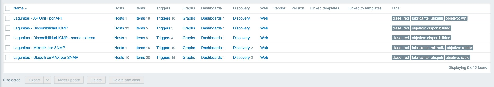
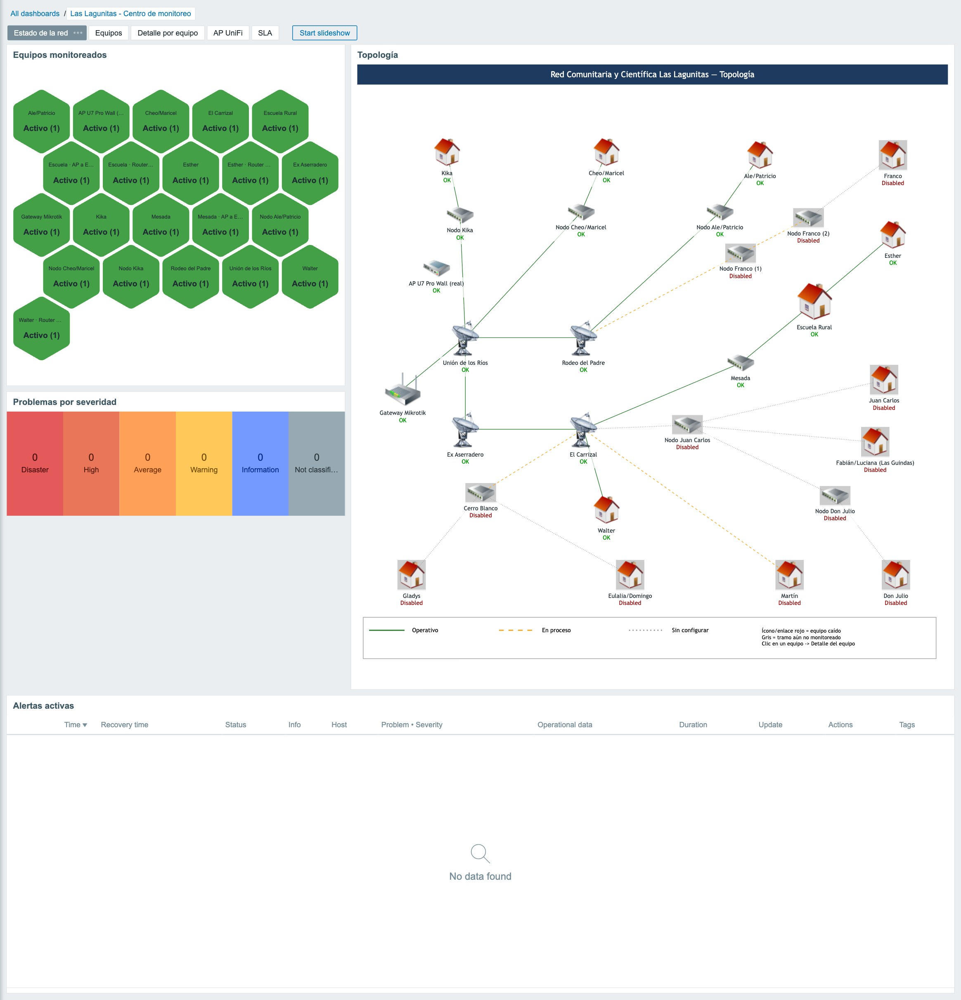
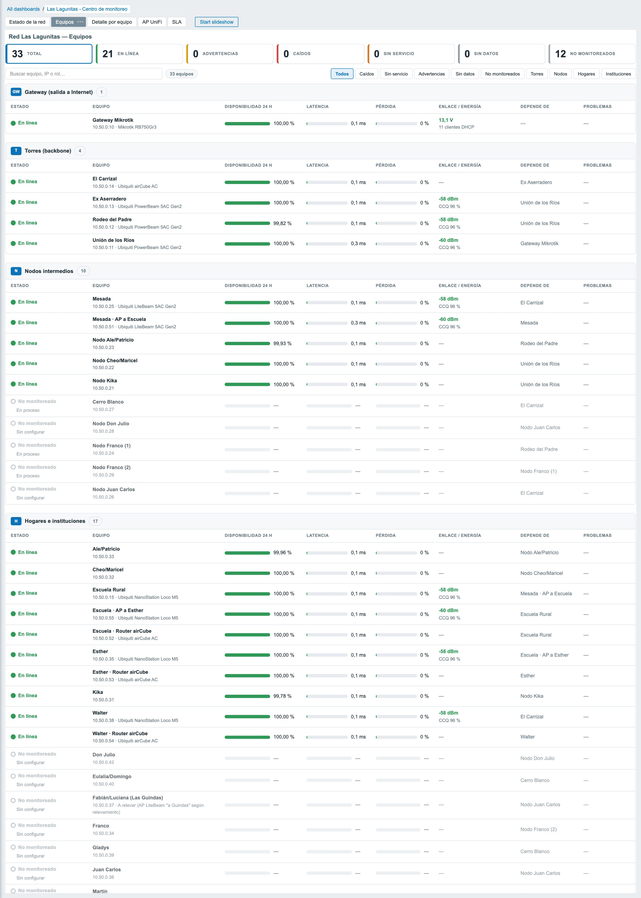
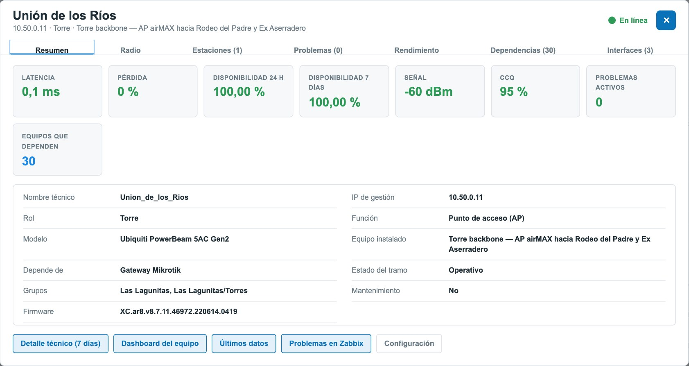
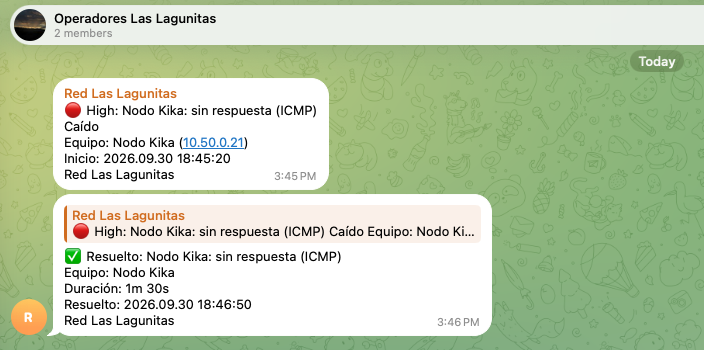

  
  

<h3 align="center">Universidad Nacional de Río Cuarto</h3>
<h3 align="center">Facultad de Ingeniería</h3>
<h3 align="center">Práctica Profesional Supervisada</h3>
<h1 align="center">“Diseño e implementación de un sistema de monitoreo para la RED comunitaria y científica Las Lagunitas”</h1>

| | |
|---|---|
| **Alumno** | Elias Coranti |
| **Tutor Universidad** | Pablo Solivella |
| **Tutor Empresa** | Daniel Bellomo |
| **Lugar** | Asociación civil Tierra Unida Activa, proyecto “Las Lagunitas Red Comunitaria y Científica” |
| **Periodo** | Septiembre 2025 a Diciembre 2025 |
| **Fecha de Entrega** | 25 de Septiembre de 2026 |

> Versión web del informe, generada desde el Word con `scripts/informe2md.py`.

## Resumen

La conectividad en zonas rurales sigue siendo un desafío para el desarrollo social, educativo y económico de muchas comunidades. En este contexto se encuentra la Red Comunitaria Las Lagunitas, una red inalámbrica de tipo WISP (Wireless Internet Service Provider) desplegada en el paraje Las Lagunitas, en Alpa Corral, Córdoba. La red fue construida y es sostenida en forma colaborativa por la Universidad Nacional de Río Cuarto (UNRC), la Asociación Civil Tierra Unida Activa (ACTUA) y AlterMundi, e interconecta torres, nodos repetidores y hogares mediante enlaces inalámbricos punto a punto y punto-multipunto. Al comenzar este trabajo la red no contaba con ninguna herramienta de monitoreo, por lo que las caídas de nodos o enlaces se detectaban únicamente por el aviso informal de los propios vecinos.

Para resolver esta carencia se desarrolló e implementó un sistema de monitoreo de red basado en Zabbix, capaz de detectar automáticamente caídas de nodos y enlaces, mostrar el estado de la red en tiempo real y generar alertas ante problemas. El trabajo comenzó con un relevamiento de la topología y de las variables críticas de la red real. Luego se evaluaron distintas herramientas y se armó un laboratorio preliminar con Linux, Apache y TLS sobre una máquina virtual. Finalmente se implementó un laboratorio de monitoreo con Zabbix sobre contenedores Docker, que reproduce la topología de la red con 20 equipos simulados e incorpora un punto de acceso real, el UniFi U7 Pro Wall, monitoreado mediante su API y por ICMP. El sistema final incluye un dashboard con indicadores en tiempo real, un mapa de topología interactivo, alertas por Telegram y disparadores (triggers) de alarma validados con pruebas reales de caída y recuperación de nodos. Se completa con documentación técnica (guías de implementación, de integración de equipos, de administración y del laboratorio) entregada a la organización para asegurar la continuidad del sistema y su apropiación por parte de la comunidad.

## Objetivos

### Objetivos generales

Diseñar e implementar un sistema de monitoreo para la Red Comunitaria y Científica Las Lagunitas que permita supervisar el estado de la infraestructura y de los servicios, detectar fallas o interrupciones en la conectividad y generar herramientas de gestión técnica y comunitaria que contribuyan a la sostenibilidad, la autogestión y la expansión de la red.

### Objetivos específicos

- Relevar el estado actual de la red comunitaria (torres, nodos y hogares) e identificar las variables críticas a monitorear (tráfico, disponibilidad, calidad de enlace, registros de eventos, consumo energético, entre otras).

- Seleccionar y configurar herramientas de monitoreo adecuadas (por ejemplo, Syslog, Zabbix u otras alternativas de software libre) en función de los recursos técnicos y comunitarios disponibles.

- Implementar un sistema básico de monitoreo que permita visualizar el estado de la red en tiempo real, detectar anomalías y generar alertas.

- Documentar el proceso de instalación, configuración y pruebas del sistema de monitoreo, elaborando manuales y guías de uso accesibles para la comunidad.

- Capacitar a integrantes de la Red Comunitaria en la utilización y mantenimiento del sistema, promoviendo la autogestión local.

- Realizar pruebas piloto y proponer mejoras para optimizar el desempeño del sistema y su escalabilidad futura.

## Descripción de la organización

La Universidad Nacional de Río Cuarto (UNRC), a través de la Facultad de Ingeniería, impulsa prácticas profesionales supervisadas con proyección social como vía para que sus estudiantes apliquen los conocimientos adquiridos en la carrera de Ingeniería en Telecomunicaciones en entornos reales con impacto comunitario directo.

La Red Comunitaria y Científica Las Lagunitas es una iniciativa conjunta entre la UNRC, organizaciones sociales y actores locales del paraje Las Lagunitas (a 12 km de Alpa Corral, Córdoba), que busca garantizar el acceso equitativo a la conectividad como derecho fundamental, promoviendo la soberanía tecnológica y el desarrollo territorial. La Asociación Civil Tierra Unida Activa (ACTUA) acompaña el proyecto y gestionó la licencia VARC que habilita el despliegue de la red, mientras que AlterMundi aporta la colaboración técnica para la infraestructura de redes comunitarias inalámbricas.

## Marco conceptual

Antes de describir el relevamiento y la implementación, conviene precisar dos conceptos sobre los que se apoya todo el trabajo. El primero es qué es una red comunitaria de tipo WISP, y el segundo, cómo está organizada internamente una plataforma de monitoreo como Zabbix.

### Redes comunitarias inalámbricas (WISP)

Un WISP (Wireless Internet Service Provider) es un proveedor de conectividad que utiliza enlaces de radiofrecuencia, generalmente en bandas no licenciadas (2,4 GHz y 5 GHz), en lugar de infraestructura cableada o de fibra óptica, como medio principal de acceso. Su arquitectura típica se organiza en dos niveles. El primero es un backbone de enlaces punto a punto de alta capacidad, que interconecta torres o puntos elevados con línea de vista entre sí. El segundo es una capa de distribución punto-multipunto que, desde cada torre, lleva la señal hacia los usuarios finales. Esta topología resulta particularmente adecuada para zonas de baja densidad poblacional y geografía dispersa, donde el tendido de fibra o cableado resulta económicamente inviable.

La falta de conectividad en las zonas rurales no es un problema menor. Un relevamiento conjunto del INTA y el ENACOM (2021) sobre 311 parajes rurales encontró que el 40 % carecía de conexión a internet, y la cifra se duplica al incluir a quienes cuentan con un servicio deficiente. Además, ocho de cada diez de estos lugares con acceso restringido vinculan la conectividad a necesidades concretas de la agricultura familiar, como educación, salud y trámites estatales (Guerrero, 2022). Frente a esta brecha, y donde un operador comercial no encuentra rentabilidad suficiente para desplegar infraestructura, surgen las redes comunitarias. En lugar de operar bajo un esquema empresarial tradicional, se construyen, gestionan y sostienen de forma colectiva por sus propios usuarios y organizaciones locales, bajo principios de autogestión, soberanía tecnológica y acceso equitativo a la conectividad como derecho.

En Argentina, la organización no gubernamental AlterMundi, que promueve "un nuevo paradigma basado en la libertad a través de la colaboración entre pares" (Association for Progressive Communications \[APC\], s.f.), acompaña técnicamente este tipo de despliegues. Para ello utiliza LibreRouter y LibreMesh, una tecnología de hardware y software libre pensada específicamente para que las comunidades rurales construyan y adapten sus propias redes sin depender de un proveedor comercial. Además, impulsa los llamados "semilleros", espacios de formación en los que las comunidades aprenden a entender por sí mismas cómo funcionan sus equipos (Guerrero, 2022). La Red Comunitaria y Científica Las Lagunitas, descripta en la sección "Descripción de la organización" y sostenida en conjunto por la UNRC, ACTUA y AlterMundi, es uno de los casos de este modelo documentados en la prensa especializada. Otras experiencias similares se desarrollan en Cerro Colorado (Calamuchita) y en catorce localidades de Santiago del Estero, Santa Fe y Neuquén (Guerrero, 2022).

Sin embargo, este tipo de infraestructura presenta desafíos operativos propios, que resultan centrales para el presente trabajo. La mayoría de los nodos no cuenta con alimentación eléctrica convencional y depende de energía solar autónoma, lo que agrega una causa de caídas de servicio ajena al enlace en sí. Por otro lado, a diferencia de un proveedor comercial, estas redes generalmente no disponen de un equipo técnico dedicado ni de un centro de operaciones de red (NOC) que supervise el estado de la infraestructura de forma permanente. Una red distribuida, vulnerable desde el punto de vista energético y sin monitoreo profesional justifica la necesidad de una plataforma de monitoreo automatizada como la desarrollada en este trabajo.

### Zabbix. Arquitectura general

Zabbix es una plataforma de monitoreo de infraestructura de código abierto, organizada en tres componentes principales que pueden desplegarse de forma independiente. El Zabbix Server es el motor central, que recolecta los datos obtenidos por los distintos métodos de chequeo, evalúa las condiciones definidas en los disparadores (triggers) y genera los eventos y alertas correspondientes. La base de datos (MySQL, en el caso de este trabajo) guarda tanto la configuración del sistema como el historial de métricas recolectadas, que alimenta los gráficos y reportes históricos. El Zabbix Frontend es la interfaz web desde la cual se administra la configuración, se visualizan los dashboards con sus widgets y se construyen los mapas de topología interactivos.

Para obtener datos de los equipos monitoreados, Zabbix ofrece métodos que pueden agruparse en dos esquemas. El monitoreo basado en agente requiere instalar el software Zabbix Agent en el equipo, que recolecta métricas locales del sistema y las reporta al servidor. Puede hacerlo mediante chequeos activos, en los que el agente solicita periódicamente su lista de tareas y envía los resultados, o pasivos, en los que el servidor consulta directamente al agente. En este trabajo el agente se utiliza solo para monitorear el propio servidor Zabbix. El monitoreo sin agente (agentless), en cambio, no requiere instalar software adicional en el equipo. Incluye chequeos simples como ICMP (ping), para verificar disponibilidad y latencia, y consultas SNMP, mediante las cuales un equipo expone sus métricas internas a través de un MIB (Management Information Base) estandarizado o propietario. Este es el esquema que se aplica a todos los equipos de la red, tanto en el laboratorio como en producción, ya que los equipos Ubiquiti y Mikrotik utilizan un firmware propietario que no admite la instalación de un agente, tal como se detalla en la sección "Variables críticas identificadas". Zabbix también permite consultar APIs web, un método que en este trabajo se utiliza para los access points UniFi.

Sobre los datos recolectados por cualquiera de estos métodos, Zabbix permite definir disparadores (triggers), que son condiciones que indican cuándo un valor representa un problema, por ejemplo que un equipo no responda al ping durante un tiempo determinado. Cuando un disparador se activa, Zabbix genera un evento y puede enviar una alerta. Los disparadores alimentan también las herramientas de visualización del Frontend, como los dashboards compuestos por widgets configurables (listados de alertas activas, tablas de estado por equipo, indicadores puntuales) y los mapas de topología interactivos, en los que cada elemento y cada enlace cambia de color en tiempo real según el estado de sus disparadores asociados.

## Metodología y justificación

Al momento de este trabajo, la red cuenta con 4 torres principales y 9 nodos intermedios en distintos estados de operación (operativos, en proceso y sin configurar). De los 12 hogares relevados, 5 están conectados de forma efectiva, al igual que la Escuela Rural, y el resto se encuentra en proceso de incorporación. Esta infraestructura se sostiene mediante encuentros y talleres de capacitación comunitaria, en un modelo de autogestión que la organización busca consolidar y expandir.

Para llevar adelante el presente trabajo se organizó un plan de acción estructurado en cuatro fases.

- **Fase 1.** Relevamiento y análisis del estado actual. Relevamiento de la infraestructura existente e identificación de las variables críticas a monitorear.

- **Fase 2.** Evaluación de herramientas y selección. Investigación y comparación de plataformas de monitoreo, con pruebas iniciales en entorno de laboratorio.

- **Fase 3.** Implementación del sistema de monitoreo. Diseño de la arquitectura, instalación y configuración del software, integración de nodos y configuración de alertas y paneles de visualización.

- **Fase 4.** Documentación, capacitación y cierre. Elaboración de manuales técnicos, instancias de capacitación comunitaria y redacción del informe final.

## Fase 1. Relevamiento y análisis del estado actual

Se realizó un relevamiento detallado de la infraestructura de conectividad existente en la red comunitaria, que abarcó torres de enlace, nodos intermedios, equipos de distribución y hogares conectados o en proceso de conexión. El trabajo incluyó la identificación de los distintos puntos de acceso y la reconstrucción de la topología completa de la red. En cada sector se documentó el dispositivo instalado, con su nombre funcional, ubicación, marca y modelo (principalmente equipos Mikrotik y Ubiquiti), rol dentro de la red y dirección IP. También se relevaron los enlaces inalámbricos punto a punto y punto-multipunto que conectan los distintos nodos, distinguiendo enlaces simples, enlaces encadenados y nodos que concentran múltiples conexiones hacia hogares.

A partir de este relevamiento se definieron las variables críticas a monitorear. La principal es la disponibilidad de los equipos, los enlaces y los nodos críticos. Le siguen la calidad del enlace inalámbrico (nivel de señal y ruido, pérdida de paquetes y latencia), especialmente relevante en los tramos con múltiples saltos, y el tráfico de red por interfaz y por enlace, que permite anticipar saturaciones. Se sumaron además el consumo eléctrico y el estado de los dispositivos, ya que buena parte del equipamiento se encuentra en ubicaciones remotas con suministro eléctrico limitado, y los eventos y registros (logs), útiles para el diagnóstico y el análisis posterior de incidentes. Este conjunto de variables constituyó la base para el diseño del sistema de monitoreo y la configuración de alertas.

### Descripción general de la infraestructura relevada

La red se organiza en torno a cuatro torres estructurales (Unión de los Ríos, Rodeo del Padre, El Carrizal y Ex Aserradero), que conforman el backbone de enlaces punto a punto, y a un conjunto de nodos repetidores intermedios, entre ellos Mesada y Cerro Blanco, que distribuyen la señal hacia los hogares. Del relevamiento surgen trece puntos de usuario final, doce viviendas familiares y la Escuela Rural de la zona. Las viviendas corresponden a Kika, Cheo y Maricel, Ale y Patricio, Franco, Esther, Juan Carlos, Fabián y Luciana (Las Guindas), Walter, Gladys, Eulalia y Domingo, Martín y Don Julio.

### Topología real de la red

La Figura 1 muestra el gráfico esquemático de la Red Comunitaria y Científica Las Lagunitas, elaborado durante el relevamiento de campo. En él se representan las torres, los nodos y los hogares, junto con el estado de cada enlace (operativo, en proceso o sin configurar). Esta topología constituye la referencia completa de la red física.

**Figura 1.** Topología esquematica de la Red Las Lagunitas.

### Estado de los enlaces

Se encuentran operativos los enlaces troncales que unen la torre Unión de los Ríos con Rodeo del Padre y con Ex Aserradero, el corredor hacia El Carrizal, Mesada y la Escuela Rural, y los tramos hacia Kika, Cheo/Maricel, Ale/Patricio, Esther y Walter. El resto de la red está en proceso de incorporación, en distintas etapas. Los enlaces hacia los nodos Cerro Blanco y Franco y hacia el hogar de Martín ya están en configuración, mientras que los tramos hacia Franco, Juan Carlos, Las Guindas (Fabián y Luciana), Don Julio, Eulalia y Domingo, y Gladys todavía no fueron configurados. Esta convivencia de tramos en distintas etapas coincide con el diagnóstico inicial de trabajos previos sobre la red, en el que se identificaron equipos instalados físicamente pero sin el enlace punto a punto configurado, cableado dañado o sin protección, gabinetes mal instalados, torres y postes de calidad precaria y baterías de paneles solares agotadas.

  

**Figura 2.** Estado precario de la infraestructura de la Red Las Lagunitas.

### Esquema de administración y conectividad

La administración de la red se centraliza en un router Mikrotik (RB750/RB950) que asigna las direcciones IP por DHCP y aplica las reglas de firewall y NAT. La conexión a Internet llega por un enlace PPPoE provisto por la Cooperativa de Alpa Corral, gracias a un acuerdo comunitario en el que la cooperativa cede ancho de banda a cambio de la fibra tendida por el proyecto. Para las tareas de administración y diagnóstico se accede en forma remota a través de una VPN L2TP/IPsec configurada en el Mikrotik, a la que es posible conectarse con el cliente VPN nativo de Windows. Una vez conectado, el Mikrotik se administra con Winbox. Los routers domésticos AirCube funcionan en modo bridge, de modo que todo el direccionamiento queda centralizado en el router principal, lo que simplifica el control de la red.

Este esquema ya permite diagnosticar la red a distancia, pero solo de forma manual y reactiva. Para saber si hay una caída, un operador tiene que conectarse por la VPN y revisar enlace por enlace desde el software propietario de Ubiquiti, ya que no existe ningún mecanismo de verificación automática ni de alerta ante fallas.

### Alimentación energética

La mayoría de los nodos no dispone de acceso a la red eléctrica convencional y depende de sistemas autónomos de generación solar fotovoltaica con baterías VRLA (12 V, 55 Ah) y controladores de carga PWM. El dimensionamiento energético relevado en trabajos previos, que considera una irradiancia promedio de 5,5 horas pico de sol para la región y una eficiencia global del sistema del 70 %, arroja una autonomía de entre 1,6 y 2 días sin aporte solar, según el tipo de antena alimentada. Esta limitación es relevante para el diseño del monitoreo, porque la caída de un nodo puede deberse tanto a una falla del enlace como al agotamiento de la batería. Por eso, el estado de la alimentación debe tratarse como una variable de monitoreo independiente, y no deducirse únicamente de la disponibilidad del enlace.

### Monitoreo existente y sus limitaciones

Sobre esta red coexisten hoy dos capas de monitoreo que conviene distinguir. La primera es una implementación piloto de sensores ambientales con tecnología LoRaWAN (un sensor de temperatura y humedad en el Nodo Mesada y un sensor ultrasónico de nivel en el tanque de agua de la Escuela Rural), integrados mediante un gateway y publicados en la plataforma en la nube Datacake, que ofrece visualización en tiempo real, históricos y alertas por correo electrónico. Esta capa, sin embargo, mide variables ambientales y de servicio puntuales, y no releva el estado de la infraestructura de red en sí, como la disponibilidad de los nodos, la calidad de los enlaces inalámbricos o el estado de los routers domésticos.

Para la infraestructura de red propiamente dicha no existe ninguna herramienta de monitoreo automatizado. La detección de caídas de nodos o enlaces depende del aviso informal de los propios vecinos o de una revisión manual por parte de un administrador conectado en forma remota. No se registra el historial de disponibilidad, no hay alertas configurables ante caídas y no existe una vista centralizada del estado de la red completa.

### Problemas detectados

Del relevamiento se desprende un conjunto de problemas que fundamentan la necesidad de un sistema de monitoreo. Hay enlaces instalados que todavía no están configurados o no funcionan, y no existe una visión remota consolidada del estado de toda la red, por lo que la detección de fallas depende por completo de la intervención manual y del aviso informal. La documentación de la red está dispersa y no tiene un formato unificado. A esto se suma una infraestructura energética con márgenes de autonomía ajustados, que puede provocar caídas de servicio que a simple vista no se distinguen de una falla de enlace. Por último, los controladores de carga solar (Epever LS-E) no tienen ninguna interfaz de comunicación remota, lo que impide conocer el estado de las baterías en forma electrónica con el hardware actualmente instalado.

### Variables críticas identificadas

A partir de este diagnóstico se identificaron las variables que el sistema de monitoreo debería relevar, evaluando en cada caso si era posible obtenerlas con el equipamiento instalado. La disponibilidad de cada nodo, medida con un chequeo activo por ICMP, puede monitorearse en todos los equipos, ya que no depende del fabricante ni del firmware, y aplica por igual a los equipos airMAX, a los routers AirCube y al núcleo Mikrotik. La latencia también se obtiene por ICMP, sin necesidad de instrumentar los equipos. La calidad del enlace punto a punto (señal recibida o RSSI, piso de ruido, calidad de canal o CCQ y capacidad estimada) puede relevarse por SNMP en los equipos de la familia airMAX (PowerBeam, LiteBeam y NanoStation/NanoLoco), que exponen estos valores a través del MIB propietario de Ubiquiti (UBNT-MIB). Existen además plantillas públicas para Zabbix que implementan esta integración, lo que confirma su viabilidad.

No ocurre lo mismo con los routers AirCube instalados en los hogares. Como usan un firmware distinto al de la línea airMAX, sin soporte de SNMP ni una API documentada, solo es posible relevar su disponibilidad por ping, sin acceso a métricas de calidad del Wi-Fi doméstico.

En cuanto al estado de la alimentación autónoma (batería y aporte solar), el relevamiento determinó que los controladores de carga instalados, Epever de la serie LS-E, no cuentan con ningún puerto de comunicación (RS-485/Modbus, Bluetooth o Wi-Fi), a diferencia de otras series del mismo fabricante (LS-B, Tracer) que sí lo incorporan y son compatibles con medidores remotos. Por lo tanto, esta variable no puede monitorearse directamente con el hardware desplegado. La excepción son los sitios donde el equipo alimentado es un router Mikrotik, que informa por SNMP su tensión de alimentación y ofrece así una medición indirecta del estado de la batería. Esta limitación queda documentada como resultado del relevamiento, y la incorporación del resto de los sitios al monitoreo energético queda planteada como trabajo futuro, sujeta al reemplazo de los controladores por un modelo con interfaz de comunicación.

Este conjunto de variables, depurado según lo que efectivamente es posible relevar, orientó en la etapa siguiente la evaluación de herramientas y el diseño del sistema de monitoreo basado en Zabbix.

## Fase 2: Evaluación de herramientas y selección

Siguiendo lo previsto en el plan de trabajo, se evaluaron dos enfoques de distinto alcance para el monitoreo de la red. El primero es un esquema basado en Syslog, centrado en la recolección centralizada de los registros (logs) que emiten los equipos de red. El segundo es una plataforma de monitoreo integral como Zabbix.

Un servidor Syslog (también llamado colector o receptor de syslog) centraliza los mensajes que le envían los dispositivos de la red, como routers, switches, servidores o aplicaciones, que deben tener configurada de antemano la dirección IP de ese servidor como destino de sus logs. El protocolo no contempla el camino inverso, por lo que el servidor no puede consultar activamente el estado de un equipo y solo recibe lo que el equipo decide enviarle. La mayoría de los sistemas Unix y de los fabricantes de red (como Cisco) incluyen su propio receptor, y también existen herramientas de terceros que suman a esa recepción básica un panel con contadores y reglas de filtrado para separar las advertencias y los errores relevantes del resto del tráfico. Dado el volumen de mensajes que puede generar Syslog, la capacidad más importante de cualquier receptor es justamente filtrar y priorizar lo que llega, ya que el protocolo en sí se limita a transmitir datos, sin evaluar el estado de los equipos ni generar alertas propias (Paessler AG, s.f.).

Syslog resulta adecuado para centralizar eventos y mensajes de diagnóstico, pero por sí solo no ofrece detección activa de disponibilidad, visualización gráfica del estado de la red ni alertas configurables. Cubrir esas funciones exigiría desarrollar herramientas adicionales sobre esa base. Zabbix, en cambio, integra en una única plataforma el chequeo activo y pasivo de disponibilidad, la recolección de métricas, un motor de disparadores (triggers) configurable, mapas de topología que reflejan el estado en tiempo real y un panel web (dashboard) con widgets gráficos, sin necesidad de desarrollo adicional.

Ambas alternativas son software libre, por lo que la decisión no respondió a una diferencia de costo, sino de alcance funcional y de esfuerzo de implementación. La red es gestionada por una organización sin equipo técnico dedicado, y para ella una plataforma única, autocontenida y con una curva de aprendizaje razonable resulta más sostenible que ensamblar y mantener herramientas adicionales sobre un esquema de logs. Por estas razones se seleccionó Zabbix como herramienta de monitoreo para la Red Las Lagunitas.

### Ejemplo comparativo: la misma caída de enlace, vista por cada sistema

En un esquema basado en Syslog, cuando se cae un enlace, el router Mikrotik de la red (RouterOS permite enviar sus logs a un servidor Syslog remoto) emite una línea de texto como la siguiente.

14:32:07 interface,info,link-down ether2 link down

Ese registro queda almacenado en el servidor de logs, mezclado con el resto de los eventos de la red, y por sí solo no dispara ninguna acción. Para que alguien se entere de la caída, un administrador tendría que revisar el archivo de logs en tiempo real, o bien habría que desarrollar un componente adicional, por ejemplo un script que analice el log, detecte el patrón "link down" y envíe un aviso. Es justamente la limitación señalada en la sección anterior.

En Zabbix, el mismo tipo de evento aparece en el dashboard sin que nadie tenga que revisar ningún archivo de texto. El caso que se muestra en la Figura 3 se registró en el laboratorio, con la primera versión del sistema, al provocar la caída del nodo Kika. El widget "Alertas activas" lista el problema con el equipo afectado, la descripción del trigger ("Nodo caído: Kika"), la severidad resaltada en rojo y el tiempo transcurrido desde que se disparó, que se actualiza en tiempo real (52 min 29 s en la captura). Al mismo tiempo, el mapa de topología marca el nodo en rojo con la misma etiqueta, y la tabla "Top hosts" lo distingue del resto mostrándolo como "Caído (0)", con 0 ms de latencia. Ninguna de estas tres vistas obliga al operador a interpretar líneas de log, ya que el problema es visible apenas se abre el dashboard, con la hora de inicio y la severidad ya clasificadas.

**Figura 3.** Alerta de la caída del host Kika.

## Fase 3: Implementación del sistema de monitoreo

El alcance de esta implementación está condicionado por el contexto del proyecto. La construcción de la red de Las Lagunitas dependía de un proyecto de conectividad financiado externamente (convocatoria BOLT de ISOC Argentina, 2024), cuya ejecución no se completó según lo planificado y todavía se encuentra en curso. Esta circunstancia, documentada en la presentación de la conferencia BattleMesh v18 (Caminati, Bellomo y Campoamor, 2026), es la que llevó a la cátedra a autorizar que el presente trabajo se resolviera mediante un laboratorio de monitoreo simulado, en lugar de un despliegue directo sobre la infraestructura productiva.

La implementación se resolvió con un enfoque de configuración como código. Toda la configuración de Zabbix (equipos, plantillas, disparadores, dependencias, mapa de topología, servicios, dashboards y alertas) se genera automáticamente a partir de un inventario de la red, de modo que el mismo proyecto sirve tanto para el laboratorio como para el despliegue productivo. Esta sección describe la arquitectura, el inventario y su aprovisionamiento, los métodos de recolección y las métricas de cada tipo de equipo, los disparadores de alarma, las herramientas de visualización y de reportería desarrolladas y las pruebas de validación. Todas las capturas corresponden al entorno real de laboratorio, con Zabbix 7.0.30 LTS.

| Elemento | Cantidad |
|----|----|
| Equipos en el inventario | 33 equipos en 28 sitios |
| Equipos monitoreados activamente | 21 (los 12 restantes, cuyos tramos siguen en proceso de incorporación, quedan registrados y deshabilitados) |
| Plantillas (templates) propias | 5 |
| Métricas (ítems) recolectadas | 685 |
| Disparadores (triggers) activos | 297 (348 contando los equipos aún deshabilitados) |
| Disparadores con dependencias | 98 |
| Dashboards | 1 centro de monitoreo de 5 páginas y 32 widgets, más 1 dashboard por plantilla |
| Mapa de topología | 28 elementos y 26 enlaces |
| Servicios y SLA | 22 servicios y 1 SLA mensual con objetivo de 99,5 % |
| Módulos propios del frontend | 2 (widget “Red Las Lagunitas” y reporte “Disponibilidad de la red”) |

**Tabla 1.** Resumen de la implementación en el laboratorio.

### Arquitectura general del sistema de monitoreo

#### Arquitectura del entorno de laboratorio

El laboratorio se ejecuta sobre una Mac con procesador Apple Silicon, con Colima como motor de contenedores Docker. El núcleo de Zabbix 7.0.30 se compone de cuatro contenedores. Zabbix Server recolecta los datos y evalúa los disparadores, y MySQL 8 guarda la configuración y el historial. Zabbix Frontend ofrece la interfaz web, accesible por HTTP en el puerto 8090, y carga los módulos propios del proyecto. Por último, Zabbix Agent 2 monitorea el propio servidor. La red comunitaria se representa en una red Docker dedicada (10.50.0.0/24), en la que cada equipo operativo del inventario es un contenedor con la misma dirección IP que tiene asignada en el inventario.

A diferencia del primer laboratorio, los equipos simulados ya no ejecutan agentes Zabbix, sino que se monitorean igual que los equipos reales, sin agente (agentless). Todos responden ICMP, y los que representan radios Ubiquiti airMAX y el router Mikrotik ejecutan un agente SNMP simulado (snmpsim) que expone los mismos identificadores (OID) de los MIB del fabricante, es decir, UBNT-AirMAX-MIB, MIKROTIK-MIB, IF-MIB y HOST-RESOURCES-MIB. Esto permite validar plantillas, disparadores y visualizaciones con los mismos datos que entregarán los equipos de campo, e incluso simular fallas (señal débil, interferencia, batería baja o pérdida del enlace a Internet) sin acceso físico a la red.

El punto de acceso real UniFi U7 Pro Wall (192.168.1.113) se integra por ICMP y por la API REST de UniFi Network, que se consulta con una clave de API a través del controlador UniFi OS Server. Durante las pruebas se detectó que la red virtual de Colima responde el ping dirigido a cualquier dirección externa, incluso a direcciones inexistentes, lo que invalidaba la medición de disponibilidad y latencia del AP desde el servidor. Para resolverlo se desarrolló una sonda ICMP que se ejecuta en el equipo anfitrión y envía los resultados a Zabbix, con las mismas métricas y disparadores que en producción, donde esta limitación no existe.

**Figura 4.** Arquitectura del entorno de laboratorio.

#### 

#### Arquitectura prevista para el entorno de producción

En producción, Zabbix Server, MySQL y el frontend se despliegan con Docker Compose sobre un servidor Linux (Ubuntu Server LTS) virtualizado en Proxmox VE, como máquina virtual o contenedor LXC, en la Cooperativa de Alpa Corral, que cuenta con alimentación eléctrica estable. El frontend se publica con HTTPS mediante un proxy inverso (Caddy), y la administración remota se realiza a través de una VPN L2TP/IPsec terminada en el router Mikrotik de la red. Los equipos reales se monitorean sin agente. Se usa ICMP para medir disponibilidad, latencia y pérdida en todos ellos, SNMP v2c para los radios airMAX y el Mikrotik, y la API de UniFi Network para los access points UniFi.

A diferencia del entorno simulado, en producción se suma un circuito de respaldo. Todos los días, una tarea programada genera un volcado comprimido de la base de datos y exporta la configuración, conserva las copias durante 14 días y las envía a un almacenamiento en la nube (Backblaze B2 o Google Drive). Además, como toda la configuración se genera desde el inventario, el pase a producción consiste en completar las direcciones IP reales en el inventario de producción y ejecutar el aprovisionamiento. El procedimiento completo se detalla en la Guía de implementación.

**Figura 5.** Arquitectura del entorno productivo.

#### Inventario y aprovisionamiento (configuración como código)

El inventario de la red, un archivo YAML, es la fuente única de verdad. Cada sitio (gateway, torre, nodo, hogar o institución) declara su nombre, rol, dirección IP, el equipo padre del que depende su conectividad, el estado del tramo (operativo, en proceso o sin configurar), sus perfiles de monitoreo (icmp, airos_snmp, mikrotik_snmp o unifi_api) y su posición en el mapa. Además, cada sitio puede incluir los equipos secundarios instalados en él, como un radio AP, una estación o un router.

La herramienta de línea de comandos desarrollada (bin/lagunitas, en Python) lee el inventario y, mediante la API JSON-RPC de Zabbix, crea o actualiza todos los objetos. Es idempotente, es decir que puede ejecutarse las veces que haga falta sin duplicar nada. Por eso, cualquier cambio en la red, ya sea un alta, una baja o un cambio de IP o de padre, se aplica editando el inventario y volviendo a ejecutarla. En cada ejecución, la herramienta genera los siguientes elementos.

- Las plantillas propias, con sus métricas, disparadores, reglas de descubrimiento y dashboards de equipo.

- Los equipos (hosts), con sus grupos por rol, etiquetas (rol, función y estado del tramo), inventario (modelo y equipo instalado), interfaces y macros.

- Las dependencias padre e hijo entre los disparadores de caída.

- El mapa de topología, con íconos por rol, enlaces con el estilo del estado del tramo y leyenda.

- El árbol de servicios y el SLA mensual.

- Los módulos propios del frontend y el dashboard principal.

- El grupo de operadores, la acción de notificación y el canal de Telegram.

Los equipos cuyo tramo todavía está en proceso de incorporación se registran deshabilitados. Aparecen en el mapa y en los listados como "No monitoreados", y se habilitan cambiando su estado en el inventario. La herramienta incluye también comandos para validar el inventario, verificar la salud de la configuración, exportarla a YAML, diagnosticar el SNMP de un equipo antes de integrarlo, consultar los identificadores de UniFi y probar el envío de notificaciones por Telegram.

Los equipos cuyo tramo todavía está en proceso de incorporación se registran deshabilitados. Aparecen en el mapa y en los listados como "No monitoreados", y se habilitan cambiando su estado en el inventario. La herramienta incluye también comandos para validar el inventario, verificar la salud de la configuración, exportarla a YAML, diagnosticar el SNMP de un equipo antes de integrarlo, consultar los identificadores de UniFi y probar el envío de notificaciones por Telegram.

| Rol | En el inventario | Monitoreados | Perfiles de monitoreo |
|:--:|----|----|----|
| Gateway | 1 | 1 | icmp + mikrotik_snmp |
| Torres | 4 | 4 | icmp + airos_snmp (3 radios) / icmp (1) |
| Nodos intermedios | 10 | 5 | icmp + airos_snmp (2 radios) / icmp |
| Hogares | 14 | 7 | icmp + airos_snmp (2 radios) / icmp |
| Instituciones | 3 | 3 | icmp + airos_snmp (2 radios) / icmp |
| Access point UniFi | 1 | 1 | icmp (sonda en el laboratorio) + unifi_api |
| Total | 33 | 21 |  |

**Tabla 2.** Sitios y equipos del inventario por rol.

### Metodos de recolección y plantillas

El monitoreo se organiza en cinco plantillas propias, y cada equipo recibe las que corresponden a sus perfiles. Todos tienen disponibilidad por ICMP y, según el hardware, se agregan SNMP (radios airMAX y router Mikrotik) o la API de UniFi (access points UniFi). Las plantillas de airMAX y Mikrotik incluyen reglas de descubrimiento (LLD) que crean automáticamente las métricas y los disparadores de cada interfaz, de cada estación asociada a un radio y del enlace a Internet.

| Plantilla | Aplica a | Método | Métricas | Disparadores | Descubrimientos |
|:--:|----|----|----|----|----|
| Disponibilidad ICMP | 32 equipos (20 monitoreados) | ICMP (fping del servidor) | 5 | 3 | — |
| Disponibilidad ICMP – sonda externa | AP del laboratorio | Sonda ICMP del equipo anfitrión (solo laboratorio) | 5 | 4 | — |
| Ubiquiti airMAX por SNMP | 10 radios (9 monitoreados) | SNMP v2c | 28, más 16 por cada interfaz o estación | 15, más 3 por cada interfaz o estación | Interfaces y estaciones |
| Mikrotik por SNMP | Gateway | SNMP v2c | 15, más 7 por cada interfaz o enlace WAN | 10, más 3 por cada interfaz o enlace WAN | Interfaces y enlace a Internet |
| AP UniFi por API | 1 access point | API REST de UniFi Network | 18 | 10 | — |

**Tabla 3.** Plantillas propias.

**Figura 6.** Plantillas propias en Zabbix.

#### Frecuencia de actualización

Todas las mediciones dinámicas se actualizan cada 10 segundos. El valor se define en una única macro global, {\$LAGUNITAS.INTERVALO}, de modo que la carga de toda la red se puede ajustar sin volver a aprovisionar, por ejemplo llevándolo a 30 s si los enlaces de radio se saturan. Los disparadores se evalúan con cada dato nuevo, por lo que también reaccionan cada 10 s. Sus ventanas de tiempo, como el "promedio de 5 minutos", no dependen del intervalo de medición.

| Qué | Frecuencia |
|:--:|----|
| Mediciones de todos los equipos (ICMP, SNMP, API UniFi, interfaces y estaciones) | 10 s |
| Disponibilidad de las últimas 24 h y 7 días (métricas calculadas) | 1 min |
| Datos estáticos (modelo, firmware, SSID, antena, número de serie, velocidad de interfaz) | 1 h |
| Descubrimiento de estaciones y del enlace a Internet / de interfaces | 10 min / 1 h |
| Widgets de los dashboards y pantallas del frontend | 10 s |

**Tabla 4.** Frecuencia de actualización.

#### Disponibilidad por ICMP

Es la base del monitoreo y se aplica a cualquier equipo con dirección IP, incluidos los routers airCube de los hogares, que no ofrecen SNMP ni una API documentada. El servidor envía pings (fping) a cada equipo y registra las métricas de la Tabla 5.

| Métrica | Descripción | Frecuencia |
|:--:|----|----|
| Disponibilidad (ICMP) | 1 si el equipo responde, 0 si no | 10 s |
| Latencia (ICMP) | Tiempo de ida y vuelta promedio | 10 s |
| Pérdida de paquetes (ICMP) | Porcentaje de paquetes sin respuesta | 10 s |
| Disponibilidad últimas 24 h | Promedio de la disponibilidad (%) | 1 min |
| Disponibilidad últimos 7 días | Promedio de la disponibilidad (%) | 1 min |

**Tabla 5.** Métricas de disponibilidad ICMP.

#### Radios Ubiquiti airMAX por SNMP

Los radios de la red (PowerBeam, LiteBeam, NanoStation y NanoLoco) se consultan por SNMP v2c con el MIB propietario de Ubiquiti. Es el grupo con mayor detalle, porque la calidad del enlace inalámbrico es la principal causa de degradación del servicio en una red de este tipo. La Tabla 6 resume las métricas que se recolectan.

| Grupo | Métricas |
|:--:|----|
| Enlace inalámbrico | Señal, piso de ruido, SNR, RSSI, CCQ, calidad y capacidad airMAX, tasas de modulación TX/RX, estaciones asociadas |
| Configuración de radio | Modo (AP o estación), frecuencia, ancho de canal, potencia de transmisión, distancia configurada, DFS, antena, SSID |
| Sistema | Uso de CPU y de memoria, temperatura, uptime, modelo, firmware airOS, nombre |
| Interfaces (descubiertas) | Estado, tráfico entrante y saliente, errores de entrada y de salida, velocidad |
| Estaciones asociadas (descubiertas) | Señal, ruido, CCQ, calidad y capacidad airMAX, tasas TX/RX, distancia, latencia y tiempo de conexión de cada equipo del otro extremo del enlace |
| Agente | Disponibilidad del agente SNMP |

**Tabla 6.** Métricas de los radios airMAX.

#### Router Mikrotik por SNMP

El router Mikrotik del gateway concentra la salida a Internet y, en los sitios alimentados con energía solar, informa además el estado de la alimentación. Se monitorea con MIKROTIK-MIB e IF-MIB, que aportan las métricas de la Tabla 7.

| Grupo | Métricas |
|:--:|----|
| Energía | Voltaje de alimentación (batería), temperatura de placa y de CPU |
| Servicio | Clientes DHCP activos y estado del enlace a Internet (PPPoE), que se descubre automáticamente |
| Sistema | Uso de CPU y de memoria, uptime, modelo, número de serie, versión de RouterOS y de RouterBOOT |
| Interfaces (descubiertas) | Estado, tráfico, errores y velocidad de cada interfaz |

**Tabla 7.** Métricas del router Mikrotik.

#### Access points UniFi por API

Los access points UniFi no se consultan por SNMP, sino por la API de integración de UniFi Network, con una clave de API guardada como macro secreta. Tres consultas HTTP (estadísticas, datos del dispositivo y clientes del sitio) devuelven documentos JSON, de los que se extraen 14 métricas mediante preprocesamiento. Entre ellas se encuentran el estado informado por el controlador, el uso de CPU y de memoria, la carga, el uptime, los clientes conectados, el tráfico del uplink (TX/RX), los reintentos de transmisión por banda (2,4, 5 y 6 GHz), la versión de firmware y el modelo. Además, se controla que el controlador sea accesible.

### Disparadores de alarma y dependencias

Las plantillas definen 42 disparadores y 6 prototipos de disparador, que se replican por cada interfaz, estación o enlace descubierto. Aplicados sobre los 21 equipos monitoreados resultan 297 disparadores activos, y si se cuentan los equipos aún deshabilitados, el total configurado es de 348. Todos los umbrales son macros, ajustables para toda la red o para un equipo puntual, por ejemplo un enlace largo con más latencia.

| Severidad | Cantidad | Uso |
|:--:|----|----|
| Disaster | 1 | Pérdida del enlace a Internet |
| High | 23 | Equipo sin respuesta, AP fuera de línea, voltaje crítico |
| Average | 65 | Sin datos SNMP/API, interfaz sin enlace, radio sin estaciones, señal crítica |
| Warning | 168 | Degradación de señal, ruido, CCQ, pérdida, latencia, recursos, temperatura o energía |
| Information | 40 | Cambios de estado, como reinicios, firmware o frecuencia de radio |
| Total | 297 |  |

**Tabla 8.** Disparadores activos por severidad.

| Plantilla | Disparador | Severidad |
|:--:|----|----|
| ICMP | Sin respuesta (ICMP) durante 90 s en el gateway, más 15 s por cada nivel de la topología (hasta 225 s en el equipo más profundo) | High |
| ICMP | Pérdida de paquetes alta (mínimo de 5 min \> 20 %) | Warning |
| ICMP | Latencia alta (promedio de 5 min \> 150 ms) | Warning |
| ICMP - sonda | La sonda ICMP no envía datos (3 min) | Warning |
| airMAX | Radio AP sin estaciones asociadas | Average |
| airMAX | Sin datos SNMP | Average |
| airMAX | Señal crítica | Average |
| airMAX | Señal débil, SNR bajo, CCQ bajo, ruido alto en el canal, calidad airMAX baja | Warning |
| airMAX | Uso de CPU alto, uso de memoria alto, temperatura alta | Warning |
| airMAX | Capacidad airMAX baja, cambió la frecuencia, cambió el firmware, el equipo se reinició | Information |
| airMAX (por interfaz) | Interfaz sin enlace | Average |
| airMAX (por interfaz / estación) | Errores en la interfaz, señal débil de la estación | Warning |
| Mikrotik | Voltaje crítico | High |
| Mikrotik | Sin datos SNMP, voltaje excesivo | Average |
| Mikrotik | Voltaje bajo, sin clientes DHCP, uso de CPU / memoria alto, temperatura alta | Warning |
| Mikrotik | Cambió la versión de RouterOS, el router se reinició | Information |
| Mikrotik (por WAN) | Sin enlace a Internet | Disaster |
| Mikrotik (por interfaz) | Interfaz sin enlace, errores en la interfaz | Average, Warning |
| UniFi | AP fuera de línea según UniFi | High |
| UniFi | Sin datos de la API de UniFi, controlador UniFi no accesible (3 min) | Average |
| UniFi | Uso de CPU / memoria alto, reintentos altos en 2,4 / 5 / 6 GHz | Warning |
| UniFi | Cambió la versión de firmware, el AP se reinició | Information |

**Tabla 9.** Disparadores definidos en las plantillas.

**Dependencias**

Cada equipo declara en el inventario de qué equipo padre depende, y el aprovisionamiento convierte esa relación en dependencias entre disparadores. El disparador de caída de cada equipo depende del de su padre, y las alertas de SNMP o de la API de un equipo dependen de su propia caída (98 disparadores tienen dependencias). Así, si cae una torre, Zabbix alerta solo por la torre y suprime las alertas de todos los nodos y hogares aguas abajo, que se muestran como "Sin servicio" en lugar de generar una tormenta de alarmas. Es la diferencia central con un esquema de logs como Syslog, en el que cada equipo emitiría su propio evento sin relación con los demás.

Para que la supresión funcione también cuando el padre y sus hijos dejan de responder al mismo tiempo, la detección de la caída se escalona por nivel de la topología. El gateway declara la caída a los 90 segundos y cada nivel inferior espera 15 segundos más que su padre, de modo que las torres lo hacen a los 105 s, el nivel siguiente a los 120 s, y así hasta los 225 s del equipo más profundo. De este modo el padre siempre entra primero en estado de problema y la dependencia suprime a los equipos aguas abajo. El aprovisionamiento calcula este valor para cada equipo a partir del inventario. Durante las pruebas se comprobó que, sin este escalonado, un equipo hijo podía detectarse un segundo antes que su padre y generar una alerta propia.

### Visualización

#### Dashboard “Las Lagunitas - Centro de monitoreo”

Es el punto de entrada del operador. Tiene cinco páginas con 32 widgets que se actualizan cada 10 segundos.

- **Estado de la red.** Reúne un panal con un hexágono por equipo (verde si está activo y rojo si está caído), los problemas agrupados por severidad, el mapa de topología y las alertas activas.

- **Equipos.** Contiene el widget propio desarrollado para el proyecto, con el estado detallado de toda la red.

- **Detalle por equipo.** Ofrece un navegador de equipos agrupados por rol. Al elegir uno, todos los widgets de la página muestran sus datos, gracias a la comunicación entre widgets que incorpora Zabbix 7.

- **AP UniFi.** Presenta las métricas del access point real.

- **SLA.** Muestra el cumplimiento mensual y el ranking de disponibilidad de los últimos 7 días.

 

**Figura 7.** Página “Estado de la red”. **Figura 8.** Página “Equipos”.

**Figura 9.** Detalle de la torre Unión de los Ríos. **Figura 10.** Pestaña “Radio”.

**Figura 11.** Pestaña “Estaciones”: equipo del otro extremo del enlace y su calidad.

**Figura 12.** Detalle del Gateway Mikrotik: pestaña “Router y energía”.

 

**Figura 13.** Pestaña “Rendimiento”. **Figura 14.** Pestaña “Dependencias”.

**Figura 15.** Pestaña “UniFi”.

#### Detalle por equipo, AP UniFi y SLA

 

**Figura 16.** Página “Detalle por equipo”. **Figura 17.** Página “AP UniFi”.

**Figura 18.** Página “SLA”.

#### Mapa de topología

El mapa se genera desde el inventario con los 28 sitios y sus 26 enlaces. Cada ícono representa el rol del equipo (gateway, torre, nodo u hogar), y cada enlace toma el estilo según el estado del tramo. Los tramos operativos se dibujan con línea continua verde, los que están en proceso con línea discontinua naranja y los que todavía no fueron configurados con línea punteada gris. Cuando un equipo cae, su ícono y su enlace pasan a rojo.

**Figura 19.** Mapa de topología de la Red Las Lagunitas.

**Figura 20.** Dashboard del equipo de la torre Unión de los Ríos: página “Detalle de radio airMAX”.

#### Reportería

Se desarrolló un módulo de reportes propio, accesible desde el menú Reports → Disponibilidad de la red. Su diseño se inspiró en el proyecto de código abierto Reportes-Zabbix de Willian Tola (lab24com), que sirvió de referencia para mejorar la primera versión del sistema. El módulo se implementó desde cero para Zabbix 7.0 y se adaptó a las necesidades de esta red, en particular a las dependencias entre equipos.

El reporte se consulta con filtros de tipo de reporte (técnico o gerencial), período, grupo, equipo, tipo de equipo, tratamiento de los mantenimientos y SLA objetivo, y presenta la siguiente información.

- **Indicadores**. Muestra los equipos evaluados, la disponibilidad media, la cantidad de equipos que cumplen y que no cumplen el SLA, las caídas, las horas-equipo de caída, las horas sin servicio, el tiempo medio de recuperación (MTTR) y la salud operativa.

- **Conclusiones automáticas.** Resume la disponibilidad promedio, los incumplimientos, la caída más larga y la de mayor impacto, según cuántos equipos dejó sin servicio.

- **Tabla por equipo.** Indica qué método se usó para medir cada equipo (ICMP, SNMP o API) y distingue dos disponibilidades. La disponibilidad propia refleja las fallas del equipo. La disponibilidad del servicio refleja lo que efectivamente vivió el usuario, incluidas las caídas de los equipos de los que depende. Completan la tabla el tiempo de caída, los incidentes, el MTTR, la mayor caída, la salud y el estado actuales y el cumplimiento del SLA, y cada incidente puede desplegarse para ver su detalle.

- **Exportación.** El reporte puede exportarse a CSV y a PDF.

El cálculo se basa en el disparador de caída de cada equipo. Los intervalos simultáneos se unen para no contar dos veces el mismo tiempo, los eventos suprimidos por mantenimiento pueden excluirse, y los problemas de señal, energía o recursos se informan como salud, sin descontar disponibilidad.

**Figura 21.** Reporte “Disponibilidad de la red”.

Desde cada fila se accede al detalle técnico del equipo, que reúne los indicadores del período, las conclusiones y recomendaciones y los datos del equipo. Para cada métrica muestra el valor actual, el promedio y el valor extremo, un gráfico de tendencia con las líneas de umbral y las horas que estuvo fuera del umbral de advertencia y del crítico. Incluye además el estado de las interfaces, las estaciones asociadas y los problemas del período agrupados, con detección de flapping, es decir, de alertas que aparecen y desaparecen repetidamente.

**Figura 22.** Detalle técnico de la torre Unión de los Ríos (radio airMAX)

### Alertas y notificaciones

Los problemas de severidad Average o superior disparan la acción "Las Lagunitas - Notificar caídas", que avisa al grupo de usuarios Operadores Las Lagunitas. Las notificaciones se envían por Telegram al grupo "Operadores Las Lagunitas" mediante un bot de solo envío, es decir, un bot que publica las alertas pero no procesa los mensajes que recibe, por lo que no constituye una vía de acceso al sistema.

### Validación

El sistema se validó con pruebas controladas sobre el laboratorio, en las que se provocaron fallas reales en los equipos simulados y se verificó la respuesta de extremo a extremo. En la primera prueba se aplicaron, mediante el simulador SNMP, tres escenarios de degradación simultáneos, que fueron señal débil en el radio del hogar Walter, interferencia en el radio del nodo Mesada y batería baja en el Gateway Mikrotik. Entre 6 y 11 minutos después se generaron seis alertas de severidad Warning, correspondientes a la señal débil del radio de Walter y de su estación asociada, al ruido alto, el CCQ bajo y el SNR bajo en Mesada, y al voltaje bajo en el gateway. Esa demora es la que necesitan los promedios de 10 y 15 minutos para superar el umbral, y existe precisamente para evitar falsas alarmas por variaciones momentáneas. Al restaurar los valores normales, todos los problemas se cerraron automáticamente en menos de 10 minutos, sin intervención del operador.

**Figura 23.** Alertas generadas por los escenarios de falla simulados por SNMP

La segunda prueba simuló una caída troncal. Se detuvo la torre Unión de los Ríos, lo que deja sin camino a los 18 equipos que dependen de ella (torres, nodos, hogares e institución). Zabbix detectó la caída en alrededor de un minuto y medio y generó una única alerta de severidad *High* ("Unión de los Ríos: sin respuesta (ICMP)") y una única notificación, aunque 19 equipos dejaron de responder. Las alertas de los equipos aguas abajo quedaron suprimidas por las dependencias. En el dashboard, el panal mostró los 19 equipos en rojo, el mapa marcó la torre y su enlace en rojo, y el widget "Equipos" distinguió la torre "Caída" de los equipos "Sin servicio". Al volver a encender los contenedores, el problema se cerró solo en 7 segundos y todos los indicadores retornaron a su estado normal.

 

**Figura 24.** Caída troncal simulada en el dashboard (páginas "Estado de la red" y "Equipos")

**Figura 25.** Caída troncal con una única alerta activa gracias a las dependencias

Por último, se verificó el circuito completo de notificación por Telegram. Al simular la caída del Nodo Kika, que deja sin servicio al hogar Kika, el grupo de operadores recibió a los 129 segundos una única alerta ("🔴 High: Nodo Kika: sin respuesta (ICMP)"). Al restablecer el nodo, llegó el aviso "✅ Resuelto" como respuesta al mensaje original.

**Figura 25.** Alertas recibidas en el grupo de Telegram de los operadores.

## Fase 4: Documentación, capacitación y cierre

Como cierre del trabajo se elaboró la documentación técnica necesaria para desplegar, operar y mantener el sistema de forma autónoma. Está compuesta por cuatro documentos. La Guía de implementación describe la arquitectura y los requisitos del entorno de producción y detalla paso a paso la instalación del servidor, la configuración de las credenciales, el acceso por HTTPS, el aprovisionamiento, los respaldos y la lista de verificación para la puesta en marcha. La Guía de integración de equipos explica cómo incorporar cada tipo de equipo de la red (radios airMAX, routers Mikrotik y airCube y access points UniFi), qué datos y alertas aporta cada uno y cómo validarlo antes de darlo de alta. El Manual de administración cubre la operación diaria, la gestión de alarmas y mantenimientos, las altas y bajas de equipos, los reportes, las notificaciones por Telegram y la resolución de problemas a partir de incidentes reales encontrados durante el desarrollo. Por último, la Guía del laboratorio explica cómo poner en marcha y utilizar el entorno de pruebas.

Toda la documentación se escribe en el repositorio del proyecto, junto con el código, de modo que se actualiza y versiona a la par del sistema, y a partir de ella se generan versiones en Word con la portada institucional. La configuración como código forma parte de esta transferencia, ya que el inventario documenta la red y permite reconstruir el sistema completo en un servidor nuevo, lo que reduce la dependencia de quien lo desarrolló.

La instancia de capacitación presencial a integrantes de la Red Comunitaria, prevista originalmente en esta fase, no se concretó. Como mitigación, se dejó a disposición de la organización la documentación técnica mencionada, redactada con el objetivo explícito de permitir la autocapacitación de la comunidad cuando las condiciones de coordinación lo permitan. Finalmente, se redactó el presente informe, que documenta e integra el proceso completo realizado.

## Resultados

A continuación se comparan, punto por punto, los resultados esperados definidos en el Plan de Trabajo original con los resultados efectivamente obtenidos.

- **Sistema de monitoreo implementado.** *Logrado*. Se instaló y se puso en marcha una plataforma Zabbix 7.0 funcional, capaz de visualizar en tiempo real el estado de la red y de detectar fallas, interrupciones o degradaciones mediante disparadores de alarma validados con pruebas reales.

- **Integración de infraestructura.** *Logrado sobre un laboratorio representativo*. Se integraron los 33 equipos del inventario de la red, de los cuales 21 se monitorean activamente y el resto queda registrado hasta que su tramo esté operativo, además de un punto de acceso real. Los radios y el router se monitorean por SNMP con las mismas métricas que entregarán los equipos de campo. La integración de los equipos físicos de la red productiva queda como trabajo futuro, condicionada a que se complete el despliegue de conectividad sobre la red real, según lo señalado en la Fase 3.

- **Herramientas de gestión y alertas**. *Logrado*. Se configuraron 297 disparadores de alarma con dependencias entre equipos, un dashboard de cinco páginas con un widget propio, un mapa de topología interactivo, notificaciones por Telegram, un SLA mensual y un módulo de reportes de disponibilidad, que facilitan la operación y el diagnóstico rápido del estado de la red.

- **Documentación técnica**. *Logrado*. Se elaboraron la Guía de implementación, la Guía de integración de equipos, el Manual de administración y la Guía del laboratorio, pensadas tanto para perfiles técnicos como para integrantes de la comunidad sin formación específica en redes.

- **Capacitación comunitaria**. *No logrado*. La capacitación presencial prevista no pudo concretarse debido a la interrupción del despliegue de conectividad de la red física, derivada de la situación del proyecto de financiamiento externo (BOLT/ISOC Argentina) descripta en la Fase 3, más que por una limitación de coordinación interna del equipo de trabajo. La documentación entregada busca mitigar esta brecha y habilitar una autocapacitación futura, una vez que las condiciones de despliegue lo permitan.

- **Informe final**. *Logrado*. El presente documento integra el proceso completo realizado, los resultados obtenidos y las líneas de trabajo futuro.

En síntesis, de los seis resultados esperados, cuatro se cumplieron en su totalidad y uno se cumplió en forma parcial, ya que la integración de infraestructura quedó limitada a un laboratorio representativo por la falta de un despliegue físico completo sobre la red productiva. El restante, la capacitación comunitaria, no pudo concretarse por razones ajenas al desarrollo técnico del proyecto.

## Conclusión

Este trabajo permitió diseñar e implementar un sistema de monitoreo funcional para la Red Comunitaria y Científica Las Lagunitas. Se partió de una situación en la que no existía ningún mecanismo centralizado de control y se llegó a una plataforma que detecta fallas en forma automática, muestra el estado de la red en tiempo real y envía alertas ante interrupciones del servicio. El proceso incluyó un relevamiento de la infraestructura real, una evaluación comparativa de herramientas que fundamentó la elección de Zabbix y dos instancias de implementación, primero un laboratorio preliminar sobre una máquina virtual y luego una arquitectura final basada en contenedores Docker. Esta última reproduce la topología de la red con los mismos métodos de monitoreo que se usarán con los equipos reales. Además, como toda la configuración se genera a partir del inventario de la red, el trabajo realizado no queda atado al laboratorio, y el pase a producción consiste en completar las direcciones reales y ejecutar el aprovisionamiento.

Las pruebas de caída, recuperación y degradación de enlaces mostraron que el sistema cumple con el objetivo de facilitar la gestión técnica de la red. El caso más claro fue la caída troncal simulada, en la que diecinueve equipos dejaron de responder y el sistema generó una única alerta que señalaba la causa. La documentación entregada, compuesta por las guías de implementación, de integración de equipos, de administración y del laboratorio, deja a disposición de la comunidad y de sus referentes técnicos el conocimiento necesario para operar y mantener el sistema en forma autónoma.

La capacitación comunitaria presencial, prevista en la Fase 4, no pudo concretarse debido a la interrupción del despliegue de conectividad de la red física, derivada de la situación del proyecto de financiamiento externo descripta en la Fase 3. Esta limitación no invalida el trabajo realizado, pero deja una tarea pendiente, que la documentación entregada busca cubrir en el corto plazo.

## Bibliografía

**AlterMundi. (s.f.). Redes comunitarias**. https://altermundi.net

**Association for Progressive Communications. (s.f.). AlterMundi**. https://www.apc.org/es/altermundi

> **Caminati, P., Bellomo, D. y Campoamor, E. (2026)**. Las Lagunitas community and scientific network \[Presentación\]. BattleMesh v18. https://laslagunitas.libre.net.ar/BattleMesh.v18/BattleMesh.v18-Community_and_Scientific_Network-Las_Lagunitas.pdf

**Docker Inc. (2024)**. Docker Compose documentation. https://docs.docker.com/compose/

> **Guerrero, M. (2022, 20 de diciembre)**. Redes comunitarias para llevar internet a las zonas rurales. Agencia Tierra Viva. https://agenciatierraviva.com.ar/redes-comunitarias-para-llevar-internet-a-las-zonas-rurales/

**MikroTik. (2024)**. RouterOS documentation. https://help.mikrotik.com

**Paessler AG. (s.f.). What is Syslog? IT Explained**. https://www.paessler.com/it-explained/syslog

> **Tola, W. (s.f.). Reportes-Zabbix \[Repositorio de software\]**. GitHub. https://github.com/lab24com/Reportes-Zabbix

**Ubiquiti Inc. (2024)**. UniFi Network application API. https://ui.com

**Zabbix LLC. (2024). Zabbix 7.0 documentation**. https://www.zabbix.com/documentation/7.0/
